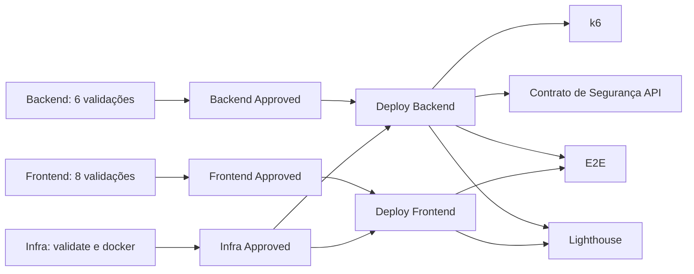

# Pipelines — EdTech

> Entregas previsíveis: validar, publicar, observar e só então promover.

## Visão geral

Este diretório contém políticas, templates e automações GitHub Actions. Os workflows estão em `.github/workflows/`.

## Estrutura

| Workflow | Gatilho | Responsabilidade |
| --- | --- | --- |
| `ci.yml` | push e pull request para `develop`/`main` | validação, deploy e testes pós-deploy |
| `ci-docs.yml` | mudanças relevantes na `main` | build/publicação do portal MkDocs e relatórios |
| CodeQL | conforme configuração em `workflows/` | análise de segurança estática |

## Comece aqui

### Validações paralelas

- **Backend:** Checkstyle, SpotBugs, build, testes unitários/JaCoCo, PiTest e OWASP Dependency-Check.
- **Frontend:** lint, type-check, segurança, build, unitários, acessibilidade, componentes e Stryker.
- **Infra:** formatação/validação Terraform e build/publicação da imagem do backend nos branches de deploy.

Os jobs `Backend Approved`, `Frontend Approved` e `Infra Approved` são gates: só liberam o deploy quando todas as tarefas da respectiva matriz passam.

### Ambientes de deploy

| Branch | Backend | Frontend |
| --- | --- | --- |
| `develop` | Cloud Run staging + Job Flyway staging | Firebase Hosting channel `staging` |
| `main` | Cloud Run produção + Job Flyway produção | Firebase Hosting produção |

Backend e frontend são independentes e fazem deploy em paralelo. Cada matriz de deploy mostra apenas o ambiente aplicável à branch atual.

### Testes pós-deploy de produção

| Job | Dependência | Artefato |
| --- | --- | --- |
| `Prod (Performance)` | Deploy Backend | `k6-summary` |
| `Prod (API Security Contract)` | Deploy Backend | `api-security-contract-report` |
| `Prod (E2E)` | Deploy Backend + Frontend | resumo do job/Allure quando aplicável |
| `Prod (Lighthouse)` | Deploy Backend + Frontend | `lighthouse-report` |

Essa separação evita que k6 e o contrato de API aguardem o frontend, enquanto E2E e Lighthouse só começam quando a aplicação completa está disponível.

## Validação, concorrência e relatórios

- Execuções concorrentes da mesma branch são canceladas em favor do commit mais recente.
- Deploys têm grupos de concorrência próprios por domínio/ambiente para evitar disputa do state Terraform e releases sobrepostas.
- Falhas de teste e artefatos ausentes bloqueiam a pipeline; relatórios não são copiados silenciosamente.

## Segurança de credenciais

O workflow usa Workload Identity Federation (OIDC) para autenticação GCP, sem chave JSON estática de deploy. Não imprima, versione ou replique valores de segredo; os jobs autenticados precisam de `id-token: write` e a identidade deve permanecer limitada ao repositório autorizado.

## Referências e contribuição

Mudanças em workflows exigem validação YAML e revisão cuidadosa de dependências, condições de branch, permissões e caminhos de artefato. Consulte também [CONTRIBUTING.md](CONTRIBUTING.md) e [SECURITY.md](SECURITY.md).
