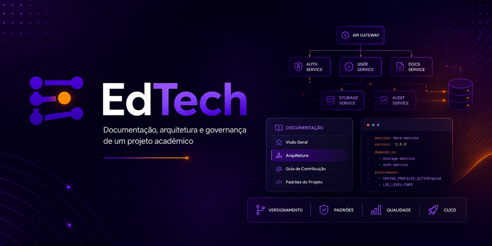

<div align="center">
  
</div>

# EdTech — Repositório Científico e Ecossistema Acadêmico

[](https://github.com/pedrohpsantos/EdTech/actions/workflows/ci-docs.yml)
[](https://github.com/pedrohpsantos/EdTech/actions/workflows/ci.yml)


**EdTech** é uma plataforma de software para digitalizar, armazenar e auditar publicações científicas, relatórios de pesquisa e datasets de laboratórios acadêmicos. O sistema foi projetado com foco em rastreabilidade, controle de acesso baseado em perfis e integridade de dados.

> **📖 Portal Oficial da Documentação:** [pedrohpsantos.github.io/EdTech](https://pedrohpsantos.github.io/EdTech/)

---

## Visão Geral

O EdTech centraliza o ciclo de vida de documentos acadêmicos em um único repositório auditável, eliminando o uso de soluções ad hoc (e-mail, pen drives, planilhas compartilhadas) para gestão de arquivos científicos.

- **Rastreabilidade:** Cada operação relevante é registrada em trilha de auditoria imutável.
- **Governança de Acesso:** Controles de autorização por perfil — Pesquisador, Orientador e Auditor.
- **Segurança:** Autenticação via JWT (Bearer Token), armazenado no Local Storage, anulando riscos de CSRF, com comunicação exclusivamente via HTTPS em produção.

---

## Estrutura do Monorepo

| Módulo | Responsabilidade | Stack |
| :--- | :--- | :--- |
| **[🎨 Frontend (UI)](frontend/README.md)** | Interface SPA responsiva para os usuários da plataforma. |     |
| **[⚙️ Backend (API)](backend/README.md)** | API RESTful com regras de negócio, segurança e persistência. |    |
| **[☁️ Infraestrutura](infra/README.md)** | Orquestração de containers e configuração de infraestrutura em nuvem. |     |
| **[📄 Documentação](docs/README.md)** | Portal de documentação técnica e arquitetural (Docs-as-Code). |  |
| **[📊 Scripts](scripts/README.md)** | Scripts de telemetria e análise para o Orientador. |   |
| **[🕵️ Testes & QA](tests/README.md)** | Cobertura, mutação, integração, carga e qualidade da plataforma. |         |

---

## Status Operacional

| Status | Item |
| :---: | :--- |
| ✅ | Autenticação JWT via cabeçalho Authorization Bearer |
| ✅ | CI/CD via GitHub Actions e deploy no Cloud Run |
| ✅ | Migrações de banco gerenciadas pelo Flyway |
| ✅ | Armazenamento de arquivos no GCS (Google Cloud Storage) |
| ✅ | Upload de documentos PDF e datasets CSV/JSON |
| ✅ | Exportação CSV da trilha de auditoria por documento |
| ✅ | Rate limiting nas rotas de autenticação (Bucket4j) |
| ✅ | Backup automático diário do banco de dados (Cloud Scheduler) |
| ✅ | Painel analítico dedicado para o Orientador |
| 🚧 | Scan de malware em uploads (ClamAV) |

---

## Principais Rotas da API

| Método | Endpoint | Autenticação | Descrição |
| :--- | :--- | :---: | :--- |
| `POST` | `/api/auth/login` | ❌ | Autentica o usuário e retorna o token JWT |
| `GET` | `/api/documents` | ✅ | Lista os documentos paginados (conforme perfil) |
| `POST` | `/api/documents/upload` | ✅ | Realiza o upload de novo documento para o GCS |
| `POST` | `/api/documents/{id}/review` | ✅ | (Orientador) Aprova ou rejeita uma submissão |

> 📌 Para a especificação OpenAPI completa, inicie a API localmente e acesse o [Swagger UI](http://localhost:8080/swagger-ui.html), ou explore a coleção pronta na pasta `.postman/`.

---

## Quick Start Local

O ambiente de desenvolvimento completo pode ser iniciado via Docker Compose, sem necessidade de instalar dependências individualmente.

```bash
# Clone o repositório
git clone https://github.com/pedrohpsantos/EdTech.git
cd EdTech

# Configure as variáveis de ambiente locais
cp infra/dev/.env.example infra/dev/.env
# Edite o arquivo infra/dev/.env com os valores adequados

# Suba os serviços
cd infra/dev
docker compose up --build -d
```

- **Frontend:** `http://localhost:5173`
- **Backend:** `http://localhost:8080`

---

## Contribuição e Governança

Consulte os documentos abaixo antes de contribuir com o projeto:

- 📖 **[Como Contribuir](.github/CONTRIBUTING.md)**
- 📜 **[Código de Conduta](.github/CODE_OF_CONDUCT.md)**
- 🔒 **[Política de Segurança](.github/SECURITY.md)**
- ⚖️ **[Licença](LICENSE)** — MIT

Todos os commits devem seguir o padrão **Conventional Commits**. PRs sem testes associados serão rejeitados pelo CI.
