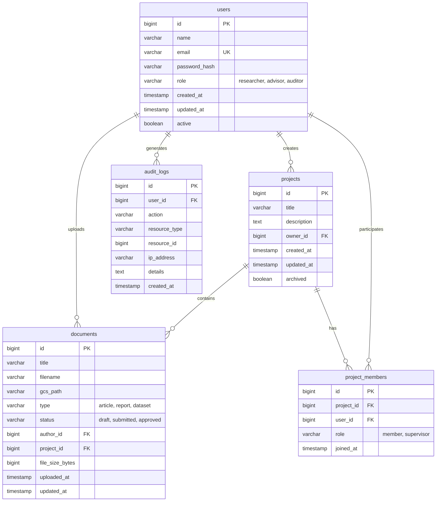
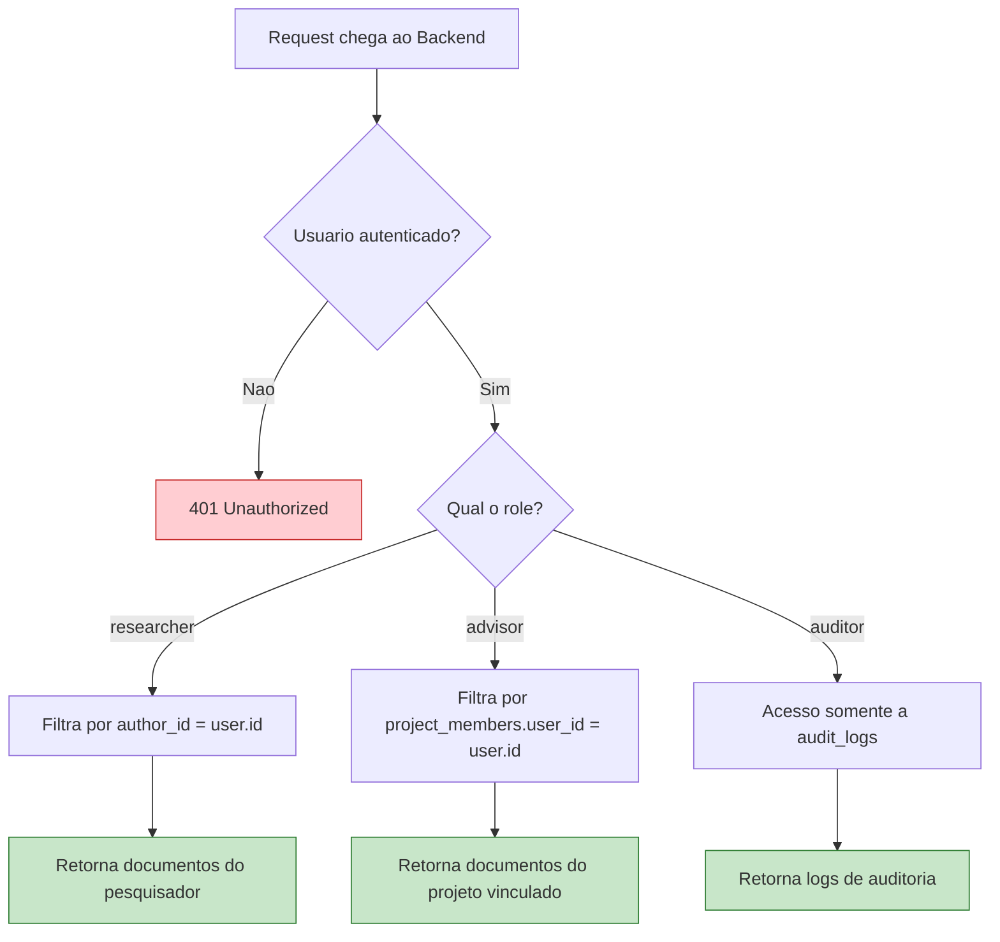

# :material-database: Diagrama de Banco de Dados

Modelagem relacional do EdTech, projetada para garantir **isolamento de dados**, **auditabilidade** e **integridade referencial**.

---

## Diagrama Entidade-Relacionamento

---

## Descrição das Entidades

### :material-account: `users`

Armazena todos os usuários do sistema com seus papéis (`role`).

| Campo | Tipo | Descrição |
| :--- | :---: | :--- |
| `id` | `BIGINT` | Chave primária auto-incremento |
| `name` | `VARCHAR(255)` | Nome completo do usuário |
| `email` | `VARCHAR(255)` | E-mail institucional — **único** |
| `password_hash` | `VARCHAR(255)` | Hash bcrypt da senha |
| `role` | `ENUM` | `researcher`, `advisor` ou `auditor` |
| `active` | `BOOLEAN` | Conta ativa ou desativada |

---

### :material-folder-open: `projects`

Agrupa documentos por laboratório ou projeto de pesquisa.

| Campo | Tipo | Descrição |
| :--- | :---: | :--- |
| `id` | `BIGINT` | Chave primária |
| `title` | `VARCHAR(255)` | Nome do projeto |
| `description` | `TEXT` | Descrição do escopo |
| `owner_id` | `BIGINT FK` | Referência ao criador (geralmente um advisor) |
| `archived` | `BOOLEAN` | Se o projeto foi encerrado |

---

### :material-account-multiple: `project_members`

Tabela associativa que vincula usuários a projetos, permitindo controle de acesso.

!!! warning "Isolamento de Dados"
    Um orientador (`advisor`) só consegue visualizar documentos de projetos onde está listado como membro. Isso garante que laboratórios diferentes não compartilhem dados entre si.

---

### :material-file-document: `documents`

Metadados dos arquivos enviados. O conteúdo binário fica no **Google Cloud Storage**.

| Campo | Tipo | Descrição |
| :--- | :---: | :--- |
| `gcs_path` | `VARCHAR` | Caminho no bucket GCS |
| `type` | `ENUM` | `article`, `report` ou `dataset` |
| `status` | `ENUM` | `draft` → `submitted` → `approved` |
| `author_id` | `BIGINT FK` | Quem fez o upload |
| `project_id` | `BIGINT FK` | Projeto vinculado |

---

### :material-clipboard-text-clock: `audit_logs`

Registros imutáveis de todas as ações relevantes do sistema.

| Campo | Tipo | Descrição |
| :--- | :---: | :--- |
| `action` | `VARCHAR` | Ex: `LOGIN`, `UPLOAD`, `DELETE`, `ACCESS_DENIED` |
| `resource_type` | `VARCHAR` | Tipo do recurso afetado (ex: `document`, `user`) |
| `resource_id` | `BIGINT` | ID do recurso afetado |
| `ip_address` | `VARCHAR` | IP do cliente |
| `details` | `TEXT` | Detalhes em JSON (user-agent, payload, etc.) |

!!! danger "Imutabilidade"
    A tabela `audit_logs` **não possui operações de UPDATE ou DELETE** no backend. Registros são apenas inseridos (`INSERT`), garantindo rastreabilidade total para fins de compliance.

---

## Estratégia de Isolamento

---

## Tecnologia de Banco

| Aspecto | Detalhe |
| :--- | :--- |
| **Engine** | PostgreSQL 15+ |
| **Serviço** | Google Cloud SQL (gerenciado) |
| **Backups** | Automáticos diários com retenção de 7 dias |
| **Conexão** | Via Cloud SQL Auth Proxy ou IP privado |
| **Migrations** | Flyway (integrado ao Spring Boot) |

---

## Histórico de Versões

| Versão | Data | Descrição | Autor |
| :---: | :---: | :--- | :--- |
| `1.0` | 29/05/2026 | Criação do documento | Pedro Henrique P. Santos |
