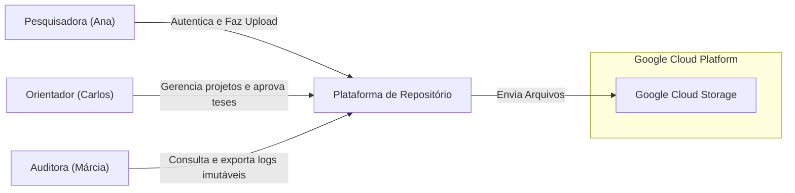
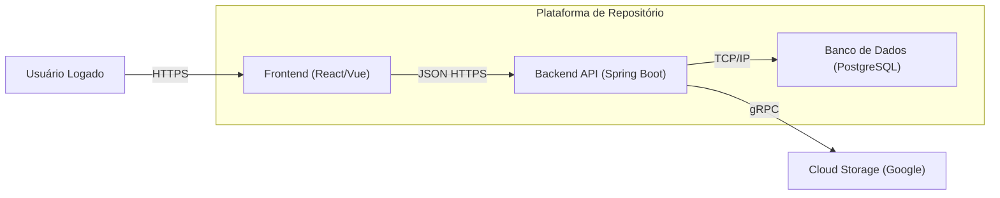

# :material-vector-arrange-below: C4 Model (Contexto e Containers)

Para substituir mapas mentais acadêmicos e diagramas rígidos, o projeto adota o **C4 Model** (desenvolvido por Simon Brown), uma taxonomia padrão de mercado para visualização de arquitetura de software de forma clara para desenvolvedores e stakeholders de negócios.

## Nível 1: Diagrama de Contexto de Sistema

O Diagrama de Contexto mostra o sistema EdTech no centro, rodeado pelos seus atores (Personas) e sistemas externos que ele interage.

## Nível 2: Diagrama de Container

No C4 Model, um "Container" representa algo que precisa estar rodando para que o sistema funcione (uma API, um App Web, um Banco de Dados).

---

## Histórico de Versões

| Versão | Data | Descrição | Autor |
| :---: | :---: | :--- | :--- |
| `1.0` | 30/05/2026 | Diagramas C4 para documentação ágil de mercado | Pedro Henrique P. Santos |
