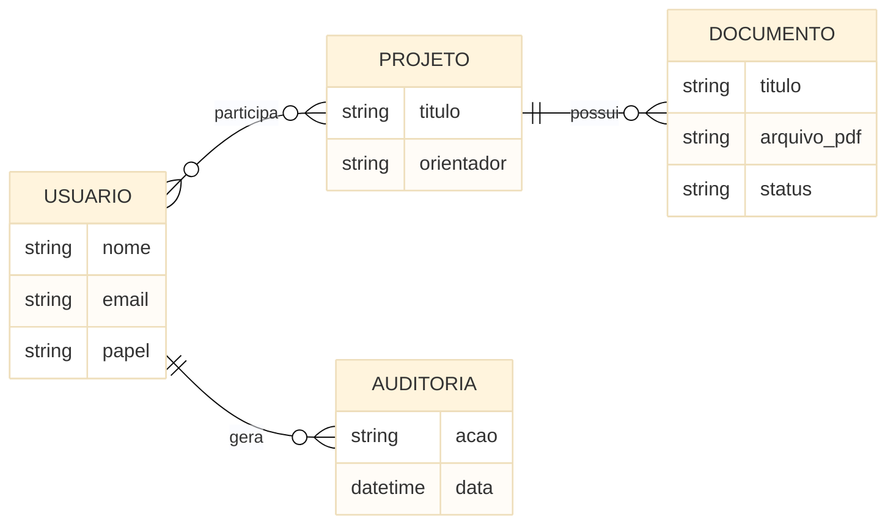

# :material-database: Arquitetura de Dados

A camada de persistência garante os pilares de confidencialidade e trilha de autoria. O sistema não permite apagar dados de auditoria e garante forte integridade referencial.

## Diagrama Entidade-Relacionamento (ERD)

### Walkthrough do diagrama

O ERD resume quatro entidades centrais e suas relações principais: usuários participam de projetos, projetos possuem documentos e usuários geram auditoria.

## Regras de Isolamento (Multi-tenancy Lógico)
Um Orientador (`advisor`) só consegue consultar metadados e arquivos dos artefatos de projetos nos quais ele está listado explicitamente na tabela de junção `project_members`. Consultas SQL abstraídas via JPA forçam *Query Filters* em tempo de compilação usando este relacionamento.

## Evolução do Esquema (Migrations)
Utilizamos a ferramenta **Flyway** atrelada ao build do Spring Boot. Nenhum script DDL (Data Definition Language) pode ser rodado manualmente no Cloud SQL; todas as criações de tabelas e índices estão versionadas dentro da pasta `src/main/resources/db/migration`.

---

## Histórico de Versões

| Versão |    Data    | Descrição                                 | Autor                    |
|:------:|:----------:|:------------------------------------------|:-------------------------|
| `1.0`  | 30/05/2026 | Criação do documento                      | Pedro Henrique P. Santos |
| `1.1`  | 30/05/2026 | ERD simplificado com foco em legibilidade | Pedro Henrique P. Santos |
