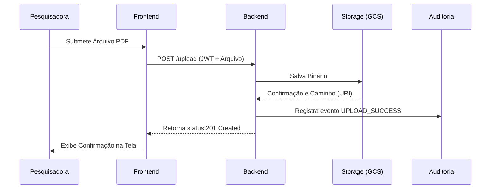

# :material-server-network: Design Técnico (Baixo Nível)

Enquanto o **C4 Model** descreve *o que* as partes fazem, este documento detalha *como* as partes interagem no nível de código e dados.

## 1. Stack Tecnológica (Visão Lógica)

O sistema é logicamente particionado em camadas cliente-servidor padrão.

### Camada Cliente (Frontend)
A interface de usuário é uma **SPA** desenvolvida em **React 18.x** com estilização responsiva baseada no **Bootstrap 5**.

| Tecnologia | Função |
| :--- | :--- |
| **HTML5/CSS3** | Estrutura semântica e estilização base |
| **Bootstrap 5** | Sistema de grid e layout |
| **React 18.x** | Biblioteca de interfaces de usuário |

### Camada Servidora (Backend)
O backend é um monólito modular que orquestra a lógica de negócio, autenticação e comunicação externa.

| Tecnologia | Função |
| :--- | :--- |
| **Java 17 LTS** | Linguagem principal |
| **Spring Boot 3.x** | Framework web e autoconfiguração |
| **Spring Security** | Gateway interno para validação de JWTs |
| **Flyway** | Migrações versionadas do banco PostgreSQL |

---

## 2. Diagrama de Classes (Domínio Principal)

A estrutura semântica dos dados reflete as entidades de negócio em memória e seus relacionamentos diretos:

---

## 3. Diagrama de Sequência: Upload e Auditoria

O fluxo crítico de negócio envolvendo a submissão de um documento acadêmico e seu correlato registro de segurança imutável:

---

## Histórico de Versões

| Versão | Data | Descrição | Autor |
| :---: | :---: | :--- | :--- |
| `1.0` | 30/05/2026 | Criação do documento | Pedro Henrique P. Santos |
| 1.1 | 13/06/2026 | Revisão técnica e reestruturação da documentação | Pedro Henrique P. Santos |
