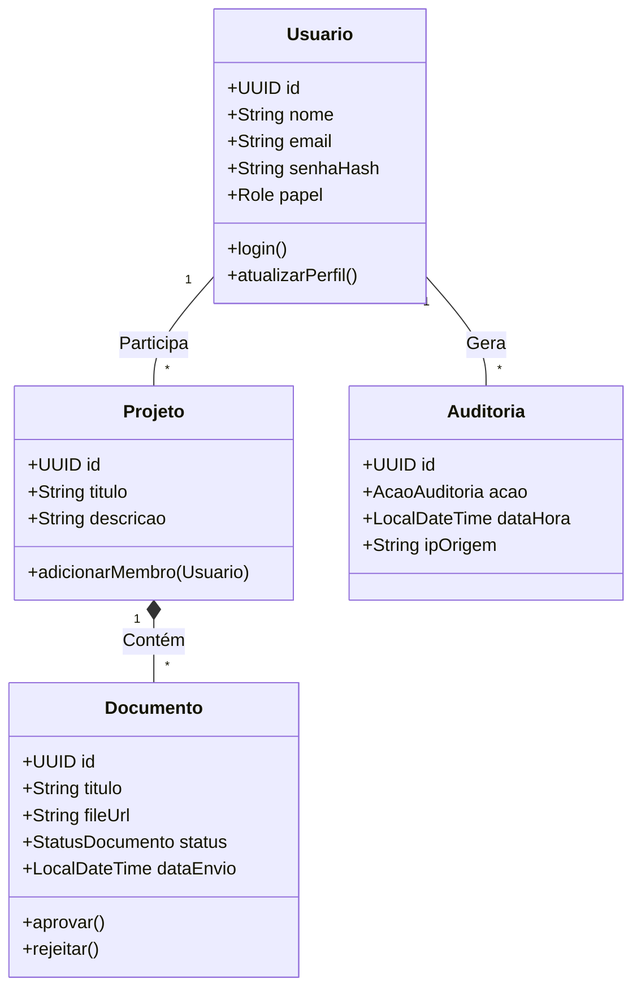
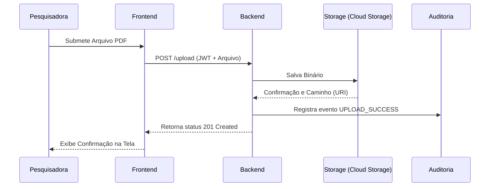

# :material-server-network: Design Técnico (Baixo Nível)

Enquanto o **C4 Model** descreve *o que* as partes fazem, este documento detalha *como* as partes interagem no nível de código e dados.

## 1. Stack Tecnológica (Visão Lógica)

O sistema é logicamente particionado em camadas cliente-servidor padrão.

### Camada Cliente (Frontend)
A interface de usuário é uma **SPA** desenvolvida em **React 19.x** com estilização responsiva baseada em **CSS puro** com Design System próprio.

| Tecnologia | Função |
| :--- | :--- |
| **HTML5/CSS3** | Estrutura semântica e estilização base |
| **Bootstrap 5** | Sistema de grid e layout (estritamente estrutural) |
| **CSS Puro** | Design System proprietário, variáveis dinâmicas e tipografia |
| **React 19.x** | Biblioteca de interfaces de usuário |

### Camada Servidora (Backend)
O backend é um monólito modular que orquestra a lógica de negócio, autenticação e comunicação externa.

| Tecnologia | Função |
| :--- | :--- |
| **Java 21 LTS** | Linguagem principal |
| **Spring Boot 4.1** | Framework web e autoconfiguração |
| **Spring Security** | Gateway interno para validação de JWTs |
| **Flyway** | Migrações versionadas do banco PostgreSQL |

---

## 2. Diagrama de Classes (Domínio Principal)

A estrutura semântica dos dados reflete as entidades de negócio em memória e seus relacionamentos diretos:

---

## 3. Diagrama de Sequência: Upload e Auditoria

O fluxo crítico de negócio envolvendo a submissão de um documento acadêmico e seu correlato registro de segurança imutável:

---

## 4. Resultados de Desempenho e Carga (K6)

De forma a validar os Requisitos Não-Funcionais RNF07 (Latência < 500ms) e RNF09 (Suportar > 50 usuários simultâneos), os testes de carga com K6 foram executados sobre a arquitetura produtiva.

Os resultados coletados confirmam a escalabilidade da nuvem atual (Cloud SQL e Cloud Storage):
- **Carga Testada:** 100 Usuários Virtuais (VUs) simultâneos sustentados.
- **Volume de Requisições:** 8.706 requisições efetuadas (downloads e tráfego público) sem **nenhum** timeout ou falha (Taxa de Erro: 0%).
- **Tempo de Resposta Médio:** 173 ms (dentro do limite esperado).
- **Tempo de Resposta p(95):** 522 ms (apresenta pequeno overhead no handshake TLS e pooling, mas perfeitamente aceitável para fluxos assíncronos e arquivos de laboratório).

O script de simulação está acoplado ao CI/CD automatizado via GitHub Actions.

---

## Histórico de Versões

| Versão | Data | Descrição | Autor |
| :---: | :---: | :--- | :--- |
| `1.0` | 30/05/2026 | Criação do documento | Pedro Henrique P. Santos |
| `1.1` | 13/06/2026 | Revisão técnica e reestruturação da documentação | Pedro Henrique P. Santos |
| `1.2` | 04/07/2026 | Revisão profunda, correção de metadados e melhorias visuais | Pedro Henrique P. Santos |

