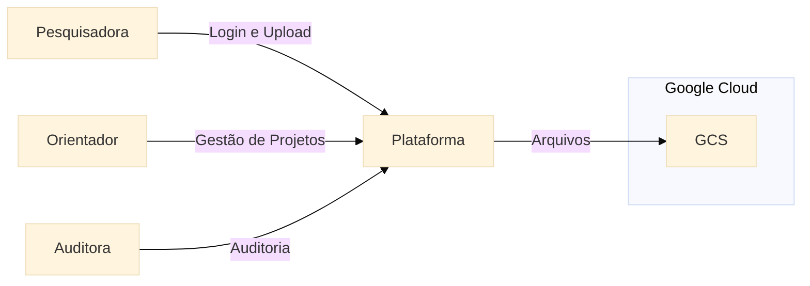
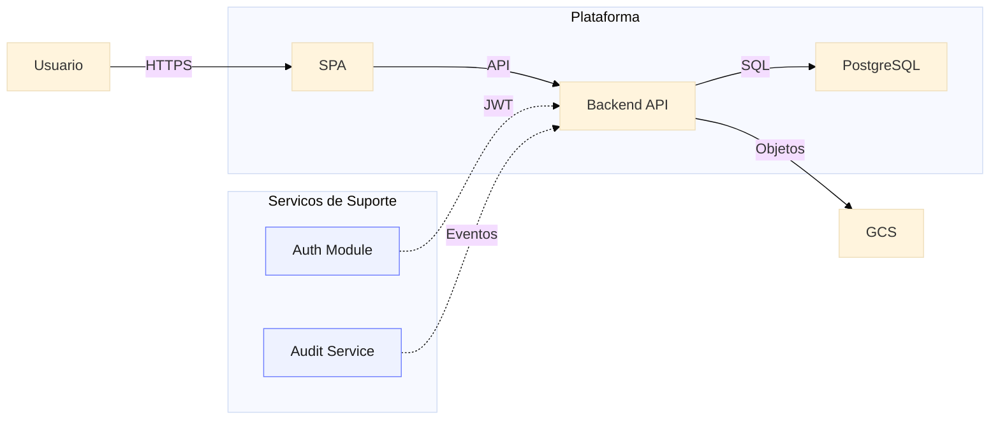

# :material-vector-arrange-below: C4 Model (Contexto e Containers)

O projeto adota o **C4 Model** (desenvolvido por Simon Brown), uma taxonomia padrão de mercado para visualização de arquitetura de software de forma clara para desenvolvedores e stakeholders de negócios.

## Nível 1: Diagrama de Contexto de Sistema

O Diagrama de Contexto mostra o sistema EdTech no centro, rodeado pelos seus atores (Personas) e sistemas externos com os quais ele interage.

### Walkthrough do diagrama

A plataforma centraliza a interação de pesquisa, orientação e auditoria, enquanto o GCS atua como storage externo para arquivos de pesquisa.

## Nível 2: Diagrama de Container

No C4 Model, um "Container" representa algo que precisa estar rodando para que o sistema funcione (uma API, um App Web, um Banco de Dados).

### Walkthrough do diagrama

O fluxo principal segue da esquerda para a direita (Usuário → SPA → API → DB/GCS), com autenticação e auditoria como serviços auxiliares conectados à API.

---

## Histórico de Versões

| Versão |    Data    | Descrição                                      | Autor                    |
| :---: | :---: | :--- | :--- |
| `1.0`  | 30/05/2026 | Diagramas C4 para documentação ágil de mercado | Pedro Henrique P. Santos |
| `1.1`  | 30/05/2026 | Refinamento visual dos diagramas C4            | Pedro Henrique P. Santos |
| 1.2 | 13/06/2026 | Revisão técnica e reestruturação da documentação | Pedro Henrique P. Santos |
