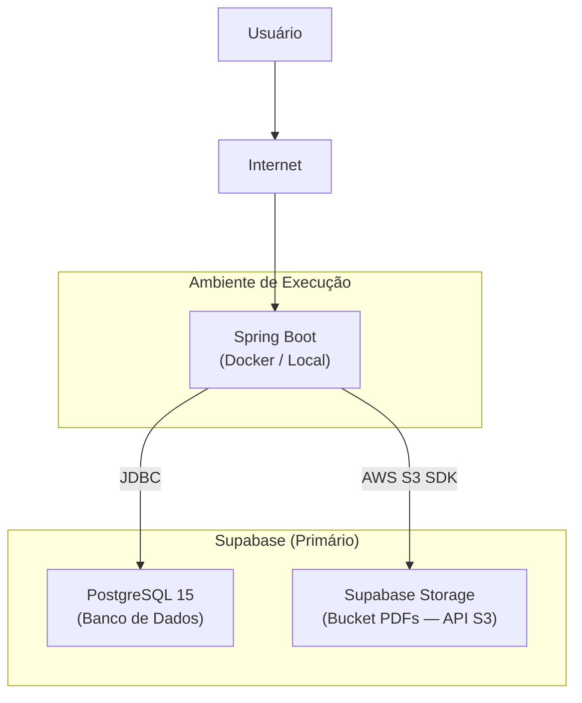
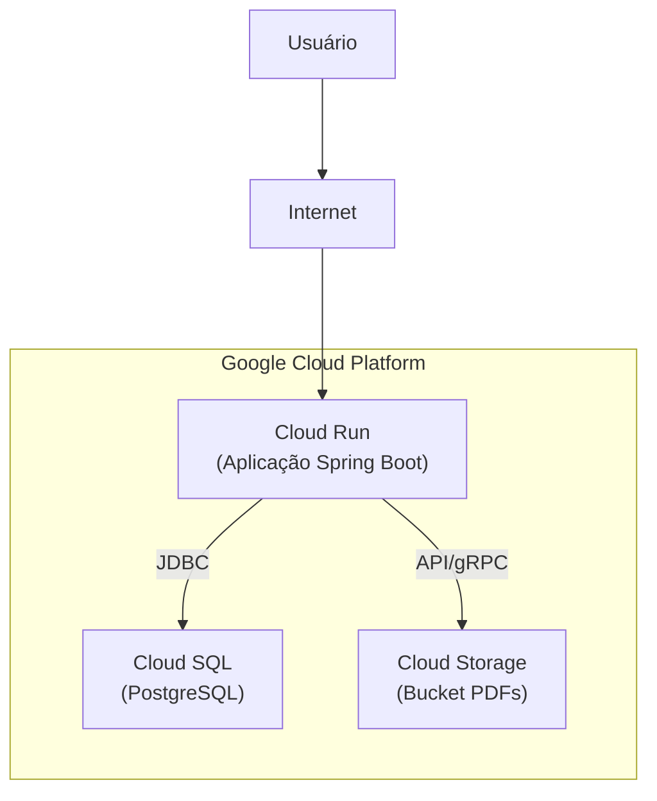

# :material-cloud: Arquitetura de Nuvem

A topologia cloud do projeto adota uma **estratégia dual de armazenamento**: Supabase Storage (primário) com GCS como fallback para futura adoção corporativa.

## Diagrama de Implantação (Atual — Supabase)

## Diagrama de Implantação (Fallback — GCP)

## Benefícios da Topologia

### Supabase (Primário)
- **Sem Billing imediato:** Cota gratuita generosa, ideal para a fase acadêmica do projeto.
- **Compatibilidade S3:** Usa o SDK `software.amazon.awssdk:s3`, tornando o projeto cloud-agnostic.
- **PostgreSQL gerenciado:** Banco de dados pronto para uso sem necessidade de provisionar infraestrutura.

### Google Cloud (Fallback)
- **Cloud Run:** Permite *cold starts* e escalonamento até zero instâncias quando não houver alunos acessando de madrugada, economizando custos.
- **Cloud SQL:** Isola a base relacional da internet pública, limitando o tráfego exclusivamente para a rede VPC interna do Cloud Run.
- **Cloud Storage:** Separa o armazenamento de grandes volumes binários (PDFs) do banco relacional, garantindo performance nas requisições textuais (APIs).

> ** Decisão Arquitetural:** Consulte a [ADR 0001](../adrs/0001-armazenamento-supabase-s3.md) para detalhes completos da estratégia de armazenamento e transição.

---

## Histórico de Versões

| Versão | Data | Descrição | Autor |
| :---: | :---: | :--- | :--- |
| `1.0` | 30/05/2026 | Criação do documento | Pedro Henrique P. Santos |
| `1.1` | 13/06/2026 | Revisão técnica e reestruturação da documentação | Pedro Henrique P. Santos |
| `2.0` | 21/06/2026 | Inclusão do Supabase como provedor primário e GCP como fallback | Pedro Henrique P. Santos |

## Histórico de Versão

| Versão | Data | Descrição | Autor |
|--------|------|-----------|-------|
| 1.0 | 28/06/2026 | Criação e estruturação do documento | Pedro Henrique P. Santos |
