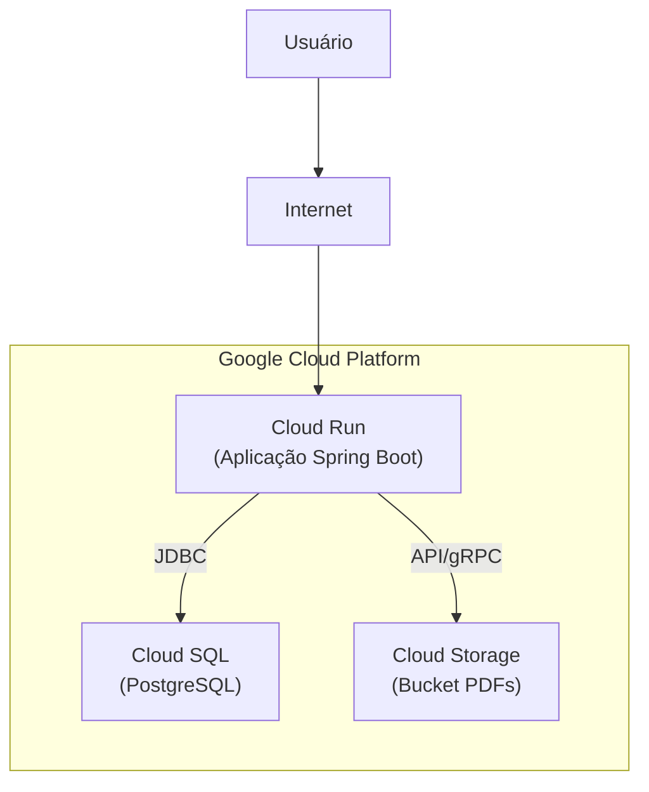

# :material-cloud: Arquitetura de Nuvem (GCP)

A topologia cloud do projeto foca em escalabilidade Serverless usando o ecossistema gerenciado do Google Cloud Platform.

## Diagrama de Implantação

## Benefícios da Topologia

- **Cloud Run:** Permite *cold starts* e escalonamento até zero instâncias quando não houver alunos acessando de madrugada, economizando custos.

- **Cloud SQL:** Isola a base relacional da internet pública, limitando o tráfego exclusivamente para a rede VPC interna do Cloud Run.

- **Cloud Storage:** Separa o armazenamento de grandes volumes binários (PDFs) do banco relacional, garantindo performance nas requisições textuais (APIs).

---

## Histórico de Versões

| Versão | Data | Descrição | Autor |
| :---: | :---: | :--- | :--- |
| `1.0` | 30/05/2026 | Criação do documento | Pedro Henrique P. Santos |
| 1.1 | 13/06/2026 | Revisão técnica e reestruturação da documentação | Pedro Henrique P. Santos |
