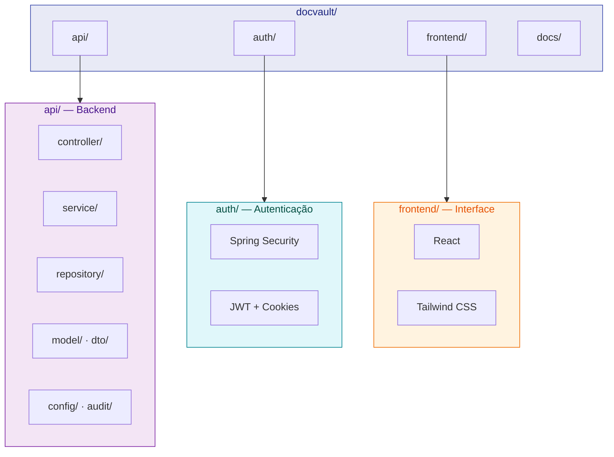
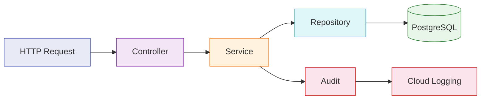

# :material-source-branch: Estrutura do Monorepo

Visão detalhada da organização do monorepo DocVault Academic — módulos, responsabilidades e arquitetura em camadas.

---

## Visão Geral



---

## Módulos

### :material-server: api/ — Backend Principal

Responsável pelas regras de negócio, upload de documentos, controle de versões e logs auditáveis.

| Tecnologia | Versão | Função |
| :--- | :---: | :--- |
| **Java** | 17 LTS | Linguagem principal |
| **Spring Boot** | 3.x | Framework web e autoconfiguração |
| **Spring Security** | — | Proteção de rotas e controle de acesso |
| **Flyway** | — | Migrações de banco de dados versionadas |
| **PostgreSQL** | — | Banco de dados relacional |

---

### :material-shield-lock: auth/ — Serviço de Autenticação

Responsável pela autenticação e autorização dos três perfis de usuário.

| Tecnologia | Função |
| :--- | :--- |
| **Spring Security** | Framework de autenticação e autorização |
| **JWT** | Tokens de sessão stateless |
| **Cookies HttpOnly + Secure** | Armazenamento seguro do token (inacessível por JavaScript) |

!!! warning "Segurança do JWT"
    Os tokens **não são armazenados em `localStorage`** (vulnerável a XSS). Utilizamos cookies `HttpOnly` + `Secure` + `SameSite=Strict`. Veja mais em [Segurança e JWT](seguranca.md).

---

### :material-monitor-dashboard: frontend/ — Interface Web

Interface React com componentes reutilizáveis organizados por persona.

| Tecnologia | Versão | Função |
| :--- | :---: | :--- |
| **React** | 18.x | Biblioteca para interfaces baseadas em componentes |
| **Tailwind CSS** | 3.x | Utilitários CSS para estilização responsiva |

=== ":material-flask: Pesquisador"

    - Upload e listagem dos próprios documentos
    - Gerenciamento de rascunhos não publicados
    - Visualização do histórico de versões

=== ":material-school: Orientador"

    - Painel de supervisão dos pesquisadores vinculados
    - Validação e acompanhamento das submissões
    - Visibilidade restrita ao próprio laboratório

=== ":material-shield-crown: Admin do Laboratório"

    - Gerenciamento de usuários e laboratórios
    - Configurações administrativas da plataforma
    - Acesso aos logs de auditoria

---

## Arquitetura em Camadas — api/



| Camada | Localização | Responsabilidade |
| :--- | :--- | :--- |
| **controller/** | `com/docvault/controller/` | Mapeamento de rotas, validação de entrada, serialização da resposta |
| **service/** | `com/docvault/service/` | Regras de negócio, transações, orquestração |
| **repository/** | `com/docvault/repository/` | Queries ao banco via Spring Data JPA |
| **model/** | `com/docvault/model/` | Entidades JPA persistidas (`@Entity`) |
| **dto/** | `com/docvault/dto/` | Contratos de entrada e saída da API |
| **config/** | `com/docvault/config/` | SecurityConfig, FlywayConfig, StorageConfig |
| **audit/** | `com/docvault/audit/` | Interceptors e serviços de log imutável |

!!! tip "Separação de Responsabilidades"
    O `dto/` desacopla o contrato da API do modelo interno. Nunca exponha entidades JPA diretamente nas respostas — isso garante que mudanças no banco não quebrem os contratos com o frontend.

---

## Estrutura Completa de Pastas

```text
docvault/
├── api/
│   ├── src/main/java/com/docvault/
│   │   ├── controller/
│   │   ├── service/
│   │   ├── repository/
│   │   ├── model/
│   │   ├── dto/
│   │   ├── config/
│   │   └── audit/
│   └── README.md
├── auth/
│   └── README.md
├── frontend/
│   └── README.md
├── docs/
│   └── README.md
└── README.md
```


---

## Histórico de Versões

| Versão | Data | Descrição | Autor |
| :---: | :---: | :--- | :--- |
| `1.0` | 29/05/2026 | Criação do documento | Pedro Henrique P. Santos |
