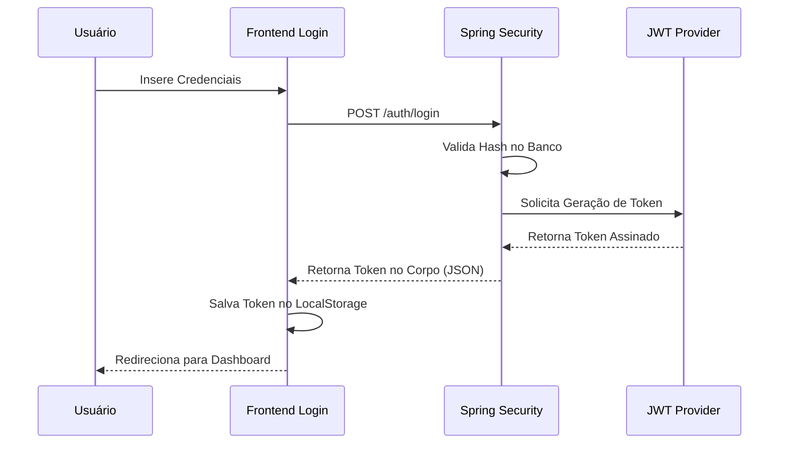
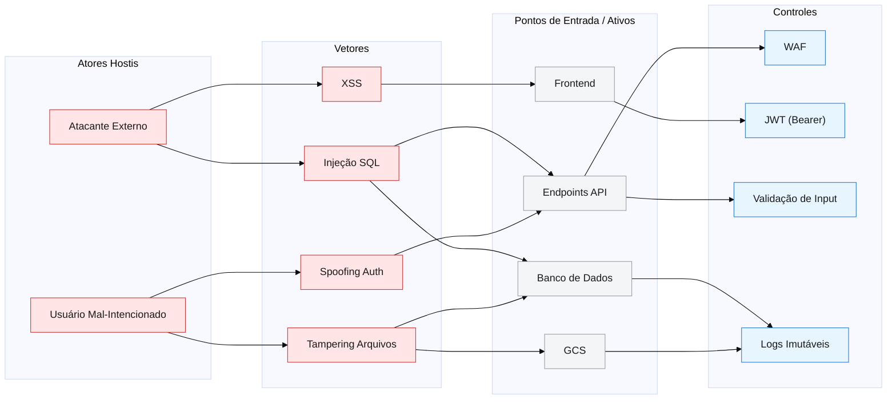
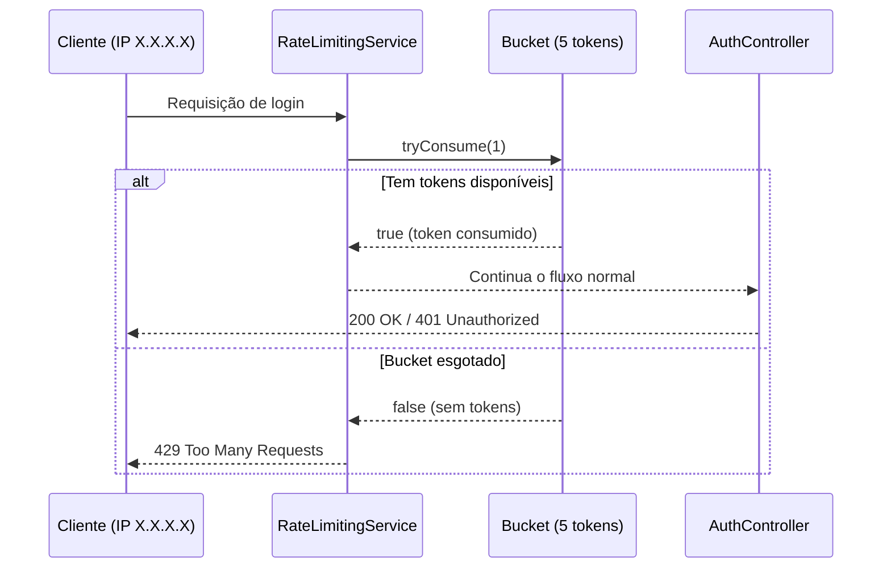
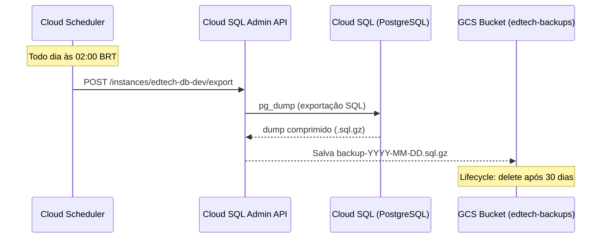

# :material-shield-lock: AppSec e Segurança

A proteção do EdTech gira em torno de duas engrenagens centrais: Autenticação Restrita (JWT via Bearer Token) e Log de Auditoria irrefutável.

## 1. Segurança de Sessão (JWT)

A aplicação não armazena sessão em banco ou memória do servidor (`STATELESS`).

### Confinamento do Token
Para manter a compatibilidade entre diferentes domínios da infraestrutura (Frontend no Firebase e Backend no Cloud Run), adotamos o uso de tokens enviados via cabeçalho `Authorization: Bearer <token>`. O Frontend armazena o token no `LocalStorage`.

Para mitigar a vulnerabilidade de XSS (Cross-Site Scripting) inerente a armazenamentos acessíveis por JavaScript, aplicamos as seguintes defesas complementares:
- **Sanitização de Inputs e Outputs:** Utilização de frameworks (React) que realizam escape automático de dados antes da renderização.
- **Isolamento de Domínio (CORS):** Política restrita de CORS para impedir que scripts de origens desconhecidas interajam com a API, bloqueando exfiltração de dados caso um script malicioso consiga ser injetado.
- **Fim do Risco de CSRF:** Por não utilizar o mecanismo padrão de Cookies do navegador, a vulnerabilidade de CSRF (Cross-Site Request Forgery) é organicamente neutralizada (browsers não anexam localStorage automaticamente nas requisições).

## 2. Controle de Acesso Baseado em Papéis (RBAC)

O sistema barra usuários em rotas específicas baseado em seu perfil institucional:

| Papel (Role) | Permissão de Rota Restrita | Comportamento Bloqueado |
| :--- | :--- | :--- |
| `researcher` | `/api/documents/upload` | Não pode ver documentos de colegas que não sejam do seu laboratório. |
| `advisor` | `/api/projects/{id}/validation` | Não pode aprovar projetos de outros orientadores. |
| `auditor` | `/api/audit-logs/` | É a única pessoa que pode ler os acessos de quebra de sigilo. |

## 3. Dinâmica do Processo Seguro (Diagrama de Upload)

O diagrama abaixo prova que todo evento de negócio vital resulta inexoravelmente num log de auditoria no banco.



### Modelo de Ameaças



### Walkthrough do diagrama

Atores hostis disparam vetores de ataque que impactam os pontos de entrada e ativos, enquanto os controles mitigam as superfícies críticas do frontend, API e persistência.

---

## 4. Rate Limiting — Proteção Contra Força Bruta (Bucket4j)

Endpoints de autenticação são alvos naturais de ataques de força bruta e credential stuffing. Para bloquear essas investidas, implementamos o **Bucket4j**, uma biblioteca Java baseada no algoritmo de *Token Bucket*.

### Como Funciona

Cada endereço IP recebe um "balde" (bucket) com **5 tokens**. Cada requisição consome 1 token. Quando o balde esvazia, o IP é bloqueado temporariamente até que os tokens se reponham (intervalo de 1 minuto).



### Endpoints Protegidos

| Endpoint | Método | Limite |
| :--- | :--- | :--- |
| `/api/auth/login` | `POST` | 5 req / minuto por IP |
| `/api/auth/recovery/request` | `POST` | 5 req / minuto por IP |

### Decisões de Design

- **Em memória (`ConcurrentHashMap`):** O estado dos buckets é mantido em memória local. É eficiente para a escala atual e evita dependência de infraestrutura extra (Redis).
- **Por IP:** O controle é feito por `HttpServletRequest.getRemoteAddr()`, garantindo que um atacante não possa abusar do sistema mesmo com IPs distintos via automação.
- **Fail-fast:** A verificação do bucket é executada *antes* de qualquer acesso ao banco de dados, garantindo custo mínimo de processamento para requisições bloqueadas.

---

## 5. Política de Backup e Recuperação de Dados

O banco de dados do EdTech possui backup automático diário gerenciado inteiramente pela infraestrutura do GCP, sem intervenção manual.

### Fluxo do Backup



### Política Vigente

| Atributo | Valor |
| :--- | :--- |
| Frequência | Diária |
| Horário | 02:00 BRT |
| Destino | `gs://edtech-backups-<PROJECT_ID>/` |
| Formato | `.sql.gz` |
| Retenção | **30 dias** (lifecycle automático) |

### Verificação pelo Orientador

Para consultar o status dos backups sem acessar o GCP Console:

```bash
uv run scripts/backup_status.py
```

O script lista os 10 backups mais recentes e emite um **alerta visual** caso o backup mais recente tenha mais de 25 horas (indicando falha no agendamento).

> Consulte o [ADR-0013](../decisoes_adrs/0013-backup-automatico.md) para a decisão de arquitetura completa.

---

## Histórico de Versões

| Versão |    Data    | Descrição                                | Autor                    |
| :---: | :---: | :--- | :--- |
| `1.0`  | 30/05/2026 | Criação do documento                     | Pedro Henrique P. Santos |
| `1.1`  | 30/05/2026 | Refino do threat model e estilos visuais | Pedro Henrique P. Santos |
| `1.2` | 13/06/2026 | Revisão técnica e reestruturação da documentação | Pedro Henrique P. Santos |
| `1.3` | 04/07/2026 | Revisão profunda, correção de metadados e melhorias visuais | Pedro Henrique P. Santos |
| `1.4` | 05/07/2026 | Adição da seção de Rate Limiting (Bucket4j) | Pedro Henrique P. Santos |
| `1.5` | 06/07/2026 | Adição da seção de Política de Backup e Recuperação | Pedro Henrique P. Santos |


