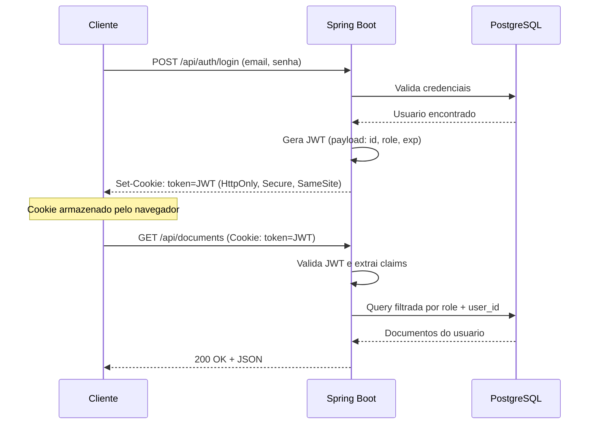
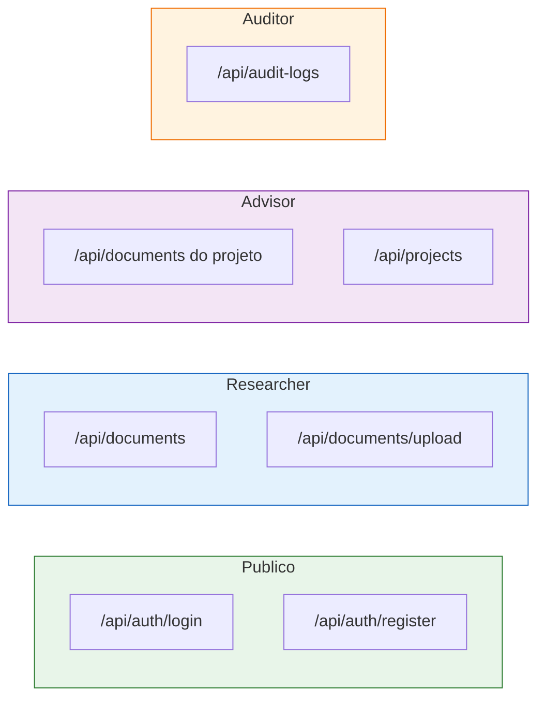
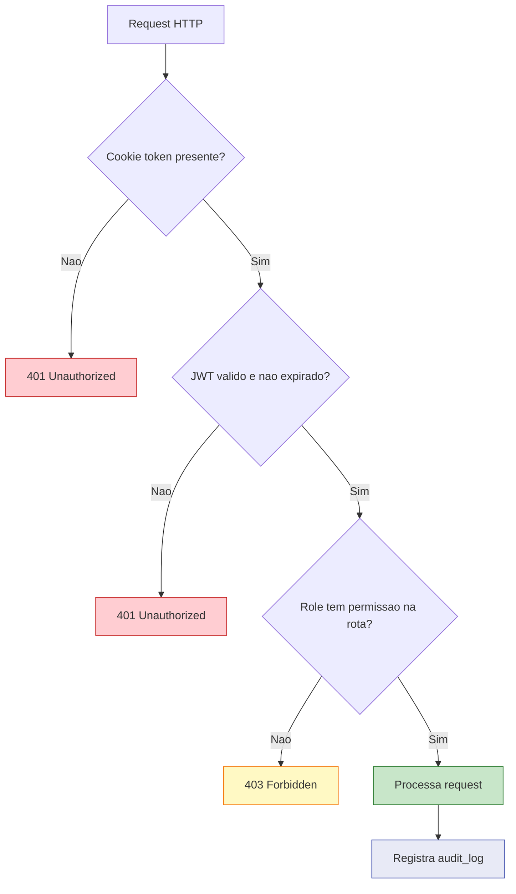

# :material-shield-lock: Segurança e JWT

Guia completo da estratégia de segurança do EdTech, cobrindo autenticação, autorização, proteção de sessão e auditoria.

---

## Visão Geral

O EdTech utiliza **Spring Security** como camada de segurança, com autenticação baseada em **JWT (JSON Web Tokens)** transmitidos via **cookies seguros** — nunca via `localStorage` ou `sessionStorage`.

---

## Configuração de Cookies

Os tokens JWT são transmitidos exclusivamente via cookies com as seguintes flags:

| Flag | Valor | Proteção |
| :--- | :---: | :--- |
| `HttpOnly` | `true` | Impede acesso via JavaScript (proteção contra **XSS**) |
| `Secure` | `true` | Cookie só é enviado em conexões **HTTPS** |
| `SameSite` | `Strict` | Impede envio em requisições cross-site (proteção contra **CSRF**) |
| `Max-Age` | `3600` | Expiração de 1 hora |
| `Path` | `/api` | Cookie limitado às rotas da API |

!!! danger "Por que NÃO usar localStorage?"
    Qualquer script injetado (XSS) pode ler o `localStorage` e roubar tokens. Com `HttpOnly`, o cookie é **invisível** para o JavaScript, tornando o roubo de sessão drasticamente mais difícil.

---

## Roles e Permissões

O Spring Security aplica autorização baseada em roles em todas as rotas da API:

| Rota | Roles permitidos | Descrição |
| :--- | :---: | :--- |
| `POST /api/auth/login` | Público | Autenticação |
| `POST /api/auth/register` | Público | Cadastro de pesquisador |
| `GET /api/documents` | `researcher`, `advisor` | Listar documentos (filtrado por role) |
| `POST /api/documents/upload` | `researcher` | Upload de novo documento |
| `GET /api/projects` | `advisor` | Listar projetos do orientador |
| `GET /api/audit-logs` | `auditor` | Consultar logs de auditoria |

---

## Fluxo de Autorização

Toda requisição autenticada passa pelo seguinte filtro no Spring Security:

---

## Logs de Auditoria

Todas as ações de segurança geram registros imutáveis na tabela `audit_logs`:

| Ação | Descrição | Severidade |
| :--- | :--- | :---: |
| `LOGIN_SUCCESS` | Login bem-sucedido | :material-information: Info |
| `LOGIN_FAILED` | Senha incorreta ou usuário inexistente | :material-alert: Warning |
| `LOGOUT` | Logout explícito | :material-information: Info |
| `ACCESS_DENIED` | Tentativa de acessar recurso sem permissão | :material-alert-octagon: Critical |
| `TOKEN_EXPIRED` | JWT expirado em request autenticada | :material-alert: Warning |
| `UPLOAD_SUCCESS` | Documento enviado com sucesso | :material-information: Info |
| `DOCUMENT_DELETED` | Documento removido pelo autor | :material-alert: Warning |

!!! info "Campos registrados em cada log"
    Cada entrada registra: `user_id`, `action`, `resource_type`, `resource_id`, `ip_address`, `timestamp` e um campo `details` em JSON com informações adicionais como user-agent e payload.

---

## Boas Práticas Implementadas

- :material-key-variant: **Senhas com Bcrypt**

    ---

    Senhas nunca são armazenadas em texto puro. Utilizamos `BCryptPasswordEncoder` do Spring Security com fator de custo 12.

- :material-timer-sand: **Expiração de Tokens**

    ---

    Tokens JWT expiram em **1 hora**. O refresh é feito via re-autenticação — sem refresh tokens para reduzir superfície de ataque.

- :material-bug-check: **Proteção contra Enumeração**

    ---

    As respostas de login retornam mensagens genéricas (`Credenciais inválidas`) para evitar que atacantes descubram e-mails cadastrados.

- :material-certificate: **HTTPS Obrigatório**

    ---

    Cloud Run aplica HTTPS por padrão. Cookies `Secure` garantem que tokens nunca trafeguem em HTTP.

---

## Histórico de Versões

| Versão | Data | Descrição | Autor |
| :---: | :---: | :--- | :--- |
| `1.0` | 29/05/2026 | Criação do documento | Pedro Henrique P. Santos |
