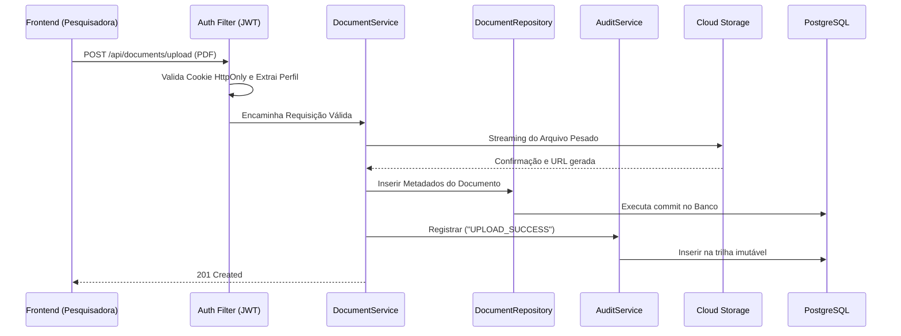

# :material-shield-lock: AppSec e Segurança

A proteção do EdTech gira em torno de duas engrenagens centrais: Autenticação Restrita (JWT em cookies) e Log de Auditoria irrefutável.

## 1. Segurança de Sessão (JWT)

A aplicação não armazena sessão em banco ou memória do servidor (`STATELESS`).

### Confinamento do Cookie
Para evitar roubo de token, o token JWT nunca deve ser lido pelo código JavaScript do frontend. O Backend Spring devolve o cookie configurado com defesas embutidas para o navegador:
    
- **`HttpOnly`:** Bloqueia leituras via JavaScript (`document.cookie`), blindando o sistema contra XSS.
- **`Secure`:** Exige tráfego via HTTPS.
- **`SameSite=Strict`:** Impede ataques CSRF bloqueando envios em sites de terceiros.

## 2. Controle de Acesso Baseado em Papéis (RBAC)

O sistema barra usuários em rotas específicas baseado em seu perfil institucional:

| Papel (Role) | Permissão de Rota Restrita | Comportamento Bloqueado |
| :--- | :--- | :--- |
| `researcher` | `/api/documents/upload` | Não pode ver documentos de colegas que não sejam do seu laboratório. |
| `advisor` | `/api/projects/{id}/validation` | Não pode aprovar projetos de outros orientadores. |
| `auditor` | `/api/audit-logs/` | É a única pessoa que pode ler os acessos de quebra de sigilo. |

## 3. Dinâmica do Processo Seguro (Diagrama de Upload)

O diagrama abaixo prova que todo evento de negócio vital resulta inexoravelmente num log de auditoria no banco.

---

## Histórico de Versões

| Versão | Data | Descrição | Autor |
| :---: | :---: | :--- | :--- |
| `1.0` | 30/05/2026 | Criação do documento | Pedro Henrique P. Santos |
