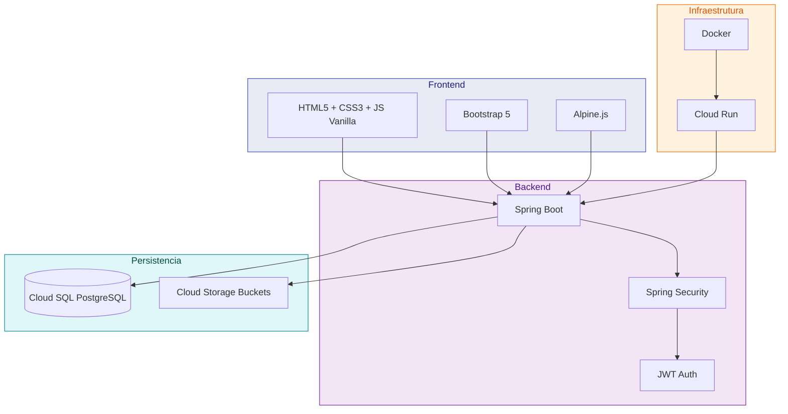
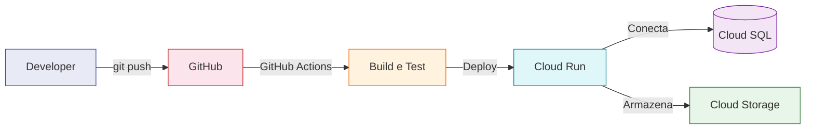

# :material-layers-triple: Stack Tecnológica

Visão detalhada de todas as tecnologias que sustentam o EdTech, com justificativas para cada escolha.

---

## Visão Geral da Arquitetura



---

## Detalhamento por Camada

### :material-monitor-dashboard: Frontend

| Tecnologia | Versão | Função |
| :--- | :---: | :--- |
| **HTML5** | — | Estrutura semântica das páginas |
| **CSS3** | — | Estilização e responsividade |
| **JavaScript Vanilla** | ES6+ | Lógica de interação e requisições à API |
| **Bootstrap 5** | 5.x | Sistema de grid, componentes prontos e layout responsivo |
| **Alpine.js** | 3.x (CDN) | Reatividade leve sem build step — ideal para interações simples |

!!! info "Por que não usar React ou Vue?"
    O projeto prioriza **simplicidade e acessibilidade**: todos os integrantes conseguem contribuir sem precisar aprender um framework complexo. Alpine.js oferece reatividade declarativa com uma curva de aprendizado mínima.

---

### :material-server: Backend

| Tecnologia | Versão | Função |
| :--- | :---: | :--- |
| **Java** | 17 LTS | Linguagem principal — tipagem forte, ecossistema maduro |
| **Spring Boot** | 3.x | Framework web, injeção de dependências, autoconfiguração |
| **Spring Security** | — | Autenticação, autorização e proteção de rotas |
| **JWT** | — | Tokens de sessão em cookies `HttpOnly` + `Secure` |

!!! warning "Segurança do JWT"
    Os tokens **não são armazenados em `localStorage`** (vulnerável a XSS). Utilizamos cookies `HttpOnly` + `Secure` + `SameSite=Strict`, que são inacessíveis por JavaScript malicioso. Veja mais em [Segurança e JWT](seguranca.md).

---

### :material-database: Banco de Dados & Storage

| Tecnologia | Função |
| :--- | :--- |
| **Google Cloud SQL for PostgreSQL** | Banco relacional gerenciado — backups automáticos, alta disponibilidade |
| **Google Cloud Storage** | Armazenamento de objetos para PDFs, datasets e relatórios |

!!! tip "Isolamento de Dados"
    Cada documento é vinculado ao `user_id` do autor. Queries sempre filtram por usuário autenticado, garantindo que pesquisadores nunca acessem dados alheios. Veja o [Diagrama de Banco](banco.md) para detalhes.

---

### :material-cloud-outline: Infraestrutura & DevOps

| Tecnologia | Função |
| :--- | :--- |
| **Docker** | Containerização do backend e banco local para desenvolvimento |
| **Google Cloud Run** | Deploy serverless com escalonamento automático |



---

### :material-test-tube: CI/CD & Qualidade

| Tecnologia | Função |
| :--- | :--- |
| **GitHub Actions** | Pipelines de CI/CD — build, testes e deploy automático |
| **JUnit** | Testes unitários do backend Java |
| **Python 3.11** | Scripts de telemetria e automação auxiliar |
| **MkDocs + Material** | Esta documentação — deploy automático via GitHub Pages |

---

## Pré-requisitos para Desenvolvimento Local

Para rodar o projeto localmente, instale:

| Ferramenta | Versão Mínima | Download |
| :--- | :---: | :--- |
| **Java JDK** | 17 | [Oracle JDK](https://www.oracle.com/java/technologies/downloads/) |
| **Docker Desktop** | latest | [Docker](https://www.docker.com/products/docker-desktop/) |
| **Python** | 3.11+ | [Python.org](https://www.python.org/downloads/) |

!!! example "Início rápido"
    ```bash
    # 1. Clone o repositório
    git clone https://github.com/AILAB-MAKERS/EdTech.git
    cd EdTech

    # 2. Configure as variáveis de ambiente
    cp infra/.env.example infra/.env
    # Edite infra/.env com suas credenciais

    # 3. Suba os containers
    docker compose -f infra/docker-compose.yml up -d

    # 4. Rode o backend
    cd backend && ./mvnw spring-boot:run
    ```
