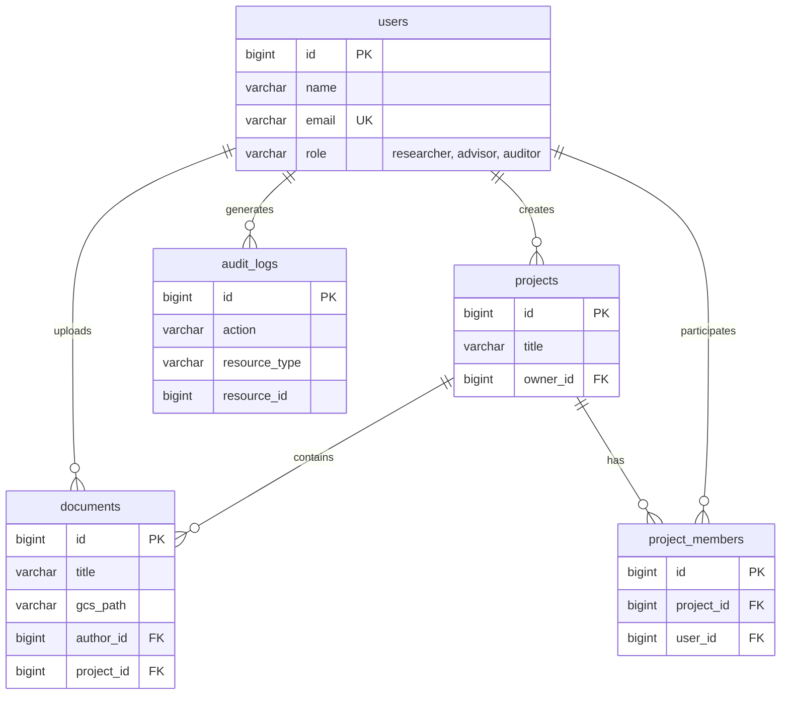

# Visão de Dados e Modelagem Relacional

A arquitetura de banco de dados suporta auditoria contínua e isolamento de informações lógicas de maneira muito estrita, base de toda a segurança da plataforma acadêmica.

## 1. Modelo de Dados Estrutural (DER)

O banco relacional modela os relacionamentos entre usuários, suas submissões em projetos específicos e, principalmente, registra as ações tomadas em tempo real através da auditoria.

---

## 2. Estratégia de Isolamento de Dados

O banco não foi modelado para compartilhamento indiscriminado. O isolamento de multi-tenancy lógico garante que os dados sejam silados adequadamente:

1.  **Visão por Vinculação**: Um Orientador (`advisor`) só consegue consultar metadados e arquivos dos artefatos de projetos nos quais ele mesmo está listado como partícipe explícito na tabela de junção `project_members`.
2.  **Filtros no JPA**: Consultas SQL abstraídas via Spring Data JPA devem compulsoriamente incorporar restrições atreladas ao `user_id` em tempo de execução via anotações customizadas, *Query Filters* ou sub-selects injetados pelas regras do Spring Security. Isso bloqueia falhas caso um Controller esqueça de validar o ID de quem faz a requisição.

---

## 3. Tecnologia de Banco e Migrações

A persistência e a evolução do esquema de banco de dados são gerenciadas pelas seguintes ferramentas:

| Aspecto | Detalhe |
| :--- | :--- |
| **Engine** | PostgreSQL 15+ |
| **Serviço Cloud** | Google Cloud SQL (gerenciado, backups automáticos) |
| **Versionamento (Migrations)** | **Flyway** |

O uso do **Flyway** integrado ao ciclo de vida do Spring Boot garante que todas as alterações estruturais do banco de dados (novas tabelas, índices, permissões) sejam estritamente versionadas através de scripts SQL imutáveis. Isso permite uma auditoria clara da evolução do esquema de banco e garante integridade determinística entre os ambientes local e de produção no GCP.
