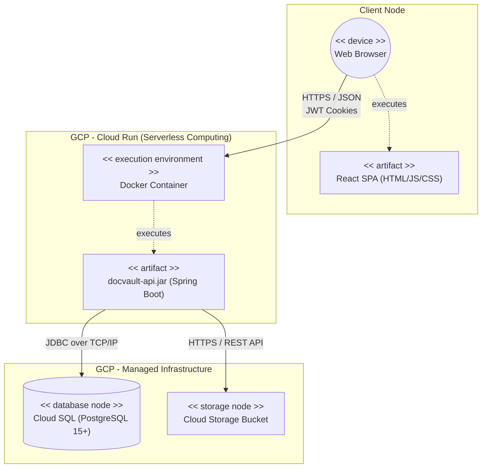

# Visão de Implantação

Representação estrita de topologia de implantação com os nós computacionais e ambientes físicos, ilustrando o fluxo dos componentes nas nuvens do Google.

## Topologia Cloud e Infraestrutura

A infraestrutura é implantada no Google Cloud Platform (GCP) buscando escalabilidade Serverless para a computação e gerenciamento automático para a persistência.

### Explicação dos Componentes Físicos

1.  **Client Node (Browser)**: A interface React é servida via CDN estática e executada inteiramente pelo navegador do usuário.
2.  **Cloud Run**: Hospeda as APIs Backend de forma escalável e sem servidor. A aplicação Java Spring Boot é empacotada em imagens Docker, o que permite subir do zero (Cold Start) para dezenas de instâncias conforme o pico de requisições de alunos e professores simultâneos.
3.  **Cloud SQL**: Fornece uma base PostgreSQL totalmente gerenciada, com backups automáticos, replicação e updates de patch sem intervenção manual, garantindo as garantias ACID necessárias para as transações de auditoria.
4.  **Cloud Storage Bucket**: Usado como cofre de arquivos brutos pesados, onde ficam salvos os PDFs das publicações e datasets compactados.
