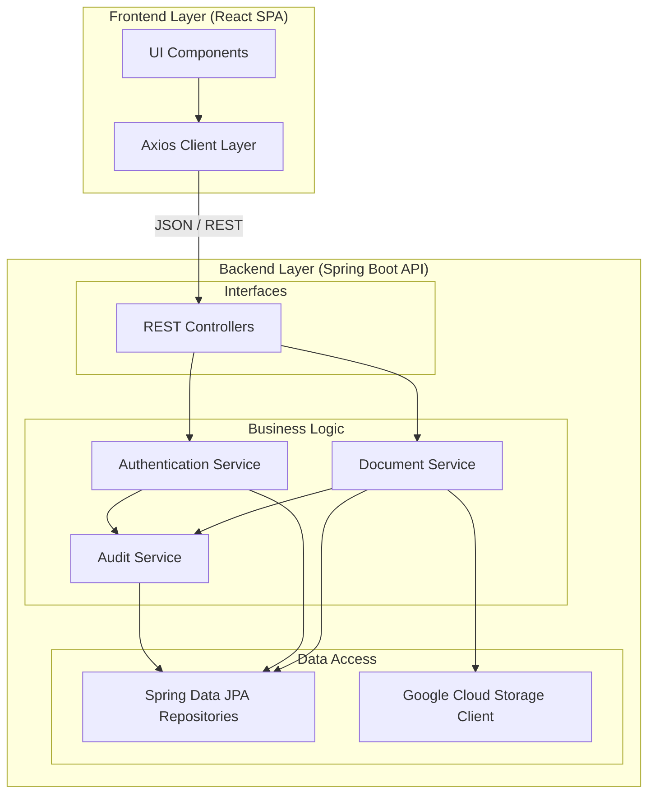

# Visão de Implementação

Como a arquitetura lógica se traduz fisicamente em pacotes, módulos de código (no monorepo) e artefatos de build.

## 1. Diagrama de Componentes (Arquitetura Interna)

A abstração do monorepo e da injeção de dependência do Spring, delineando quem acessa o quê.



---

## 2. Mapeamento de Diretórios (Monorepo)

A organização estrutural no repositório de código garante a separação clara de responsabilidades:

```text
docvault/
├── api/
│   ├── src/main/java/com/docvault/
│   │   ├── controller/   # Traduz requisições HTTP para DTOs
│   │   ├── service/      # Orquestração transacional (@Transactional)
│   │   ├── repository/   # Isolamento das queries SQL (Spring Data)
│   │   ├── model/        # Entidades JPA persistidas (@Entity)
│   │   ├── dto/          # Contratos de entrada e saída da API
│   │   ├── config/       # Configurações globais
│   │   └── audit/        # Interceptors e lógica de auditoria
│   └── pom.xml
├── auth/                 # Micro-serviço (ou módulo) de Auth dedicado
├── frontend/             # Interface SPA React
│   └── src/components/   # Componentes e views de UI
└── docs/                 # Documentação MkDocs
```

---

## 3. Documentação de Reutilização (Padrões de Projeto)

O projeto consolida práticas para evitar a repetição de código (DRY) através da componentização e padrões arquiteturais:

*   **Data Transfer Objects (DTO)**: Aplicados sistematicamente na pasta `dto/` para expor apenas os dados necessários em vez das Entidades (Models) completas, protegendo metadados do banco como datas de controle interno e senhas em hash.
*   **Facade Pattern (Controllers)**: Os controladores (em `controller/`) atuam como fachadas muito enxutas, limitando-se a serializar objetos para JSON e rotear para os devidos *Services*, evitando lógica de negócios na camada web.
*   **Auditoria Cross-cutting (Aspect-Oriented / Interceptors)**: O serviço `AuditService` atua transversalmente, podendo ser injetado em qualquer *Service* ou acoplado via Interceptadores/AOP para gerar trilhas consistentes sem inflar as funções de negócio centrais com lógica de auditoria manual.
*   **Repository Pattern**: Encapsulamento completo do acesso a dados em `repository/` através de Spring Data JPA para assegurar que componentes de alto nível ignorem os dialetos e peculiaridades do PostgreSQL subjacente.
