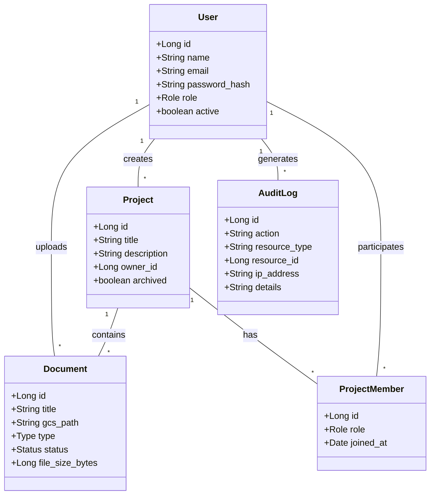
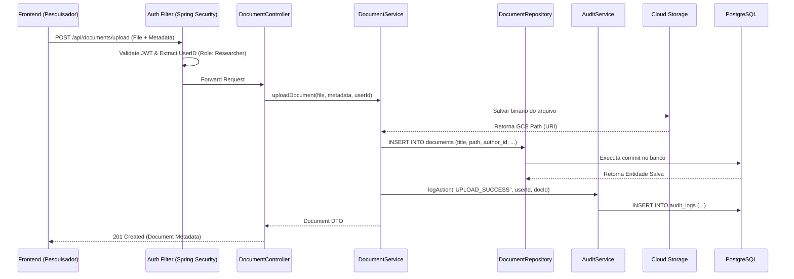

# Visão de Processos

A modelagem da dinâmica do sistema em tempo de execução revela como os objetos de domínio interagem durante os fluxos transacionais e de negócio.

## 1. Diagrama de Classes (Domínio Principal)

A estrutura semântica dos dados reflete as entidades de negócio em memória e seus relacionamentos diretos:

---

## 2. Diagrama de Sequência: Upload e Auditoria

O fluxo crítico de negócio envolvendo a submissão de um documento acadêmico e seu correlato registro de segurança imutável:

