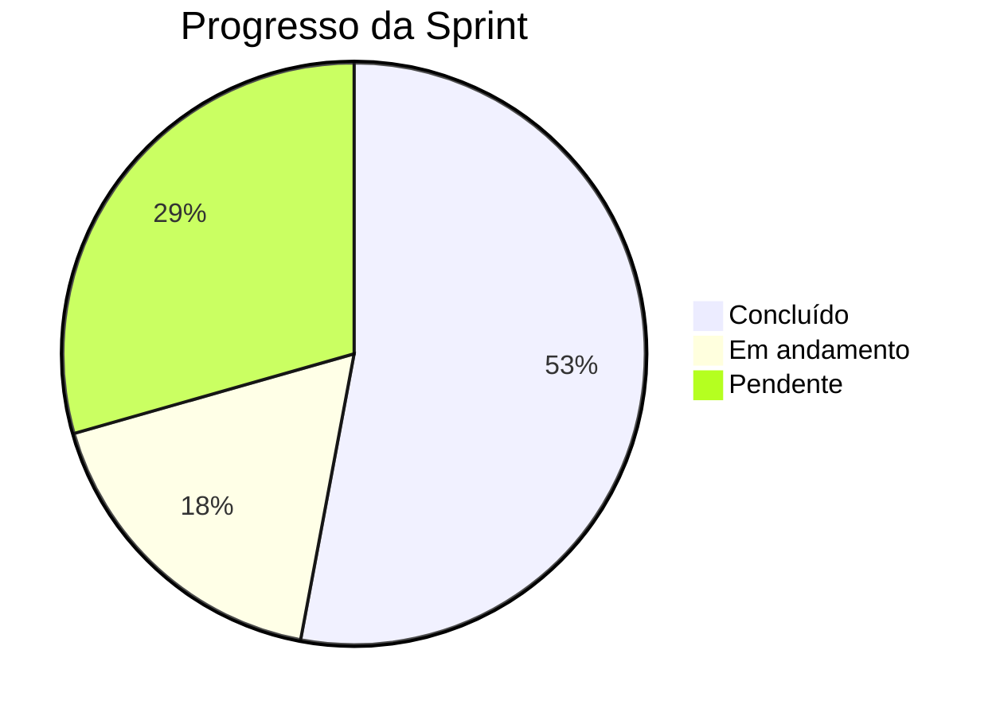

# :material-rocket-launch: Semana 2 — Autenticação

🚧 Em Andamento

**Período:** 19/05/2026 – 25/05/2026

---

## Objetivo da Sprint

Implementar o módulo de autenticação completo: modelagem do banco de dados, API de registro e login, JWT com cookies seguros e tela de login no frontend.

---

## Entregas Planejadas

### :material-database: Modelagem do Banco

- [x] Definição do esquema de tabelas (`users`, `documents`, `projects`, `audit_logs`)
- [x] Diagrama ER documentado na MkDocs
- [x] Configuração do Flyway para migrations
- [ ] Seed de dados para desenvolvimento local

### :material-server: API de Autenticação

- [x] Endpoint `POST /api/auth/register` — cadastro de pesquisador
- [x] Endpoint `POST /api/auth/login` — autenticação com retorno de JWT
- [ ] Endpoint `POST /api/auth/logout` — invalidação do cookie
- [ ] Validação de e-mail institucional

### :material-shield-lock: Segurança JWT

- [x] Geração de token JWT com claims (`id`, `role`, `exp`)
- [x] Armazenamento em cookie `HttpOnly` + `Secure` + `SameSite=Strict`
- [x] Filtro de autenticação no Spring Security
- [ ] Tratamento de token expirado com resposta adequada

### :material-monitor: Frontend de Login

- [ ] Tela de login responsiva (Bootstrap 5 + Alpine.js)
- [ ] Tela de registro com validação de formulário
- [ ] Feedback visual de erros (credenciais inválidas, campos obrigatórios)
- [ ] Redirecionamento pós-login para o dashboard

### :material-clipboard-text-clock: Auditoria

- [x] Log de `LOGIN_SUCCESS` e `LOGIN_FAILED`
- [ ] Log de `LOGOUT`
- [ ] Log de `ACCESS_DENIED` para rotas protegidas

---

## Progresso Visual

---

## Desafios Encontrados

!!! warning "Configuração do Spring Security"
    A integração do filtro JWT customizado com o `SecurityFilterChain` do Spring Security 6.x exigiu atenção especial à ordem dos filtros e ao handling de exceções. A documentação oficial do Spring foi essencial.

!!! info "CORS em desenvolvimento local"
    O frontend servido pelo Live Server (porta 5500) precisou de configuração de CORS no Spring para aceitar cookies cross-origin durante o desenvolvimento.

---

## Resumo Técnico

| Métrica | Valor |
| :--- | :---: |
| Commits na semana | ~20 |
| PRs abertos/mergeados | 4 / 2 |
| Endpoints implementados | 2 / 4 |
| Testes JUnit escritos | 5 |

---

## Próximos Passos

→ **Semana 3** *(planejada)*: Upload de documentos, integração com Google Cloud Storage e listagem filtrada por usuário.
