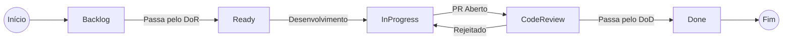

# :material-check-all: DoR & DoD (Critérios de Aceite)

Para garantir a qualidade nas entregas ágeis do projeto EdTech, substituímos pesados checklists de inspeção e Casos de Uso por contratos claros de transição de status para as Histórias de Usuário.

## Definition of Ready (DoR)

Uma História de Usuário (`User Story`) ou Tarefa apenas entra no Sprint (Muda para a coluna **To Do / Ready for Dev**) quando cumpre os seguintes requisitos mínimos de planejamento:

1. **Clareza de Valor:** A história segue o formato "Como [Persona], Quero [Ação], Para Que [Benefício]".

2. **Critérios de Aceitação:** Possui pelo menos um cenário de teste comportamental validado (ex: "Dado que sou Ana, Quando clico no envio, Então o status muda para Draft").

3. **Alinhamento Arquitetural:** A abordagem a ser tomada não viola as *Architecture Decision Records* (ADRs) estabelecidas para o projeto.

4. **Dependências Mapeadas:** Quaisquer bloqueios com outras equipes (ex: aprovação de design do Figma, definições de infraestrutura prévias) já estão resolvidos.

5. **Estimada:** A equipe compreende a complexidade da tarefa e a pontuou (Story Points ou T-Shirt Sizes).

## Definition of Done (DoD)

Uma funcionalidade desenvolvida só pode ser dada como concluída (Muda para **Done / Produção**) se passar pelo rigor técnico abaixo:

1. **Código Funcional:** O código atende a 100% dos Critérios de Aceitação descritos no ticket.

2. **Revisão de Pares (Code Review):** O Pull Request (PR) foi aprovado pelo Tech Lead.

3. **Integração Contínua (CI):** A pipeline do **GitHub Actions** (`ADR 0008`) foi finalizada com sucesso (Lint, Build e Testes).

4. **Testes Automatizados:** As novas lógicas de negócio estão cobertas por testes automatizados e não quebram os cenários antigos.

5. **Banco de Dados (Flyway):** Qualquer alteração estrutural no PostgreSQL (`ADR 0004`) conta com seu respectivo script de migração versionado no repositório (`ADR 0007`).

6. **Docs-as-Code:** Se a PR alterou o sistema de forma sensível, a documentação atrelada (C4 Model, Jornadas, ADRs no MkDocs - `ADR 0009`) foi atualizada junto ao código na mesma PR.

7. **Critérios de Segurança e Infraestrutura:** A imagem do Docker deve realizar o build para o ambiente Serverless (**Cloud Run** - `ADR 0003`). Nenhuma chave ou senha (credentials) pode ser vazada no commit, e a autenticação das rotas deve respeitar as proteções contra XSS via **JWT em HttpOnly** (`ADR 0002`).

---

## Histórico de Versões

| Versão | Data | Descrição | Autor |
| :---: | :---: | :--- | :--- |
| `1.0` | 30/05/2026 | Definição inicial do DoR e DoD do projeto | Pedro Henrique P. Santos |
| `1.1` | 04/06/2026 | Inclusão de garantias de arquitetura, Flyway, CI/CD e Docs-as-Code (ADRs) | Pedro Henrique P. Santos |
| `1.2` | 13/06/2026 | Revisão técnica e reestruturação da documentação | Pedro Henrique P. Santos |
| `2.0` | 04/07/2026 | Revisão profunda, correção de metadados e melhorias visuais | Pedro Henrique P. Santos |

