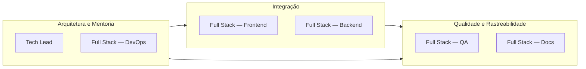
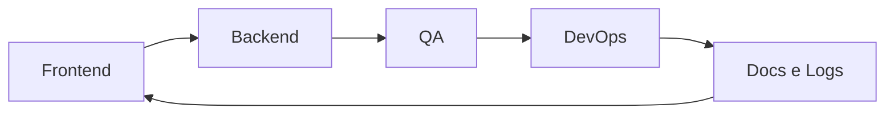
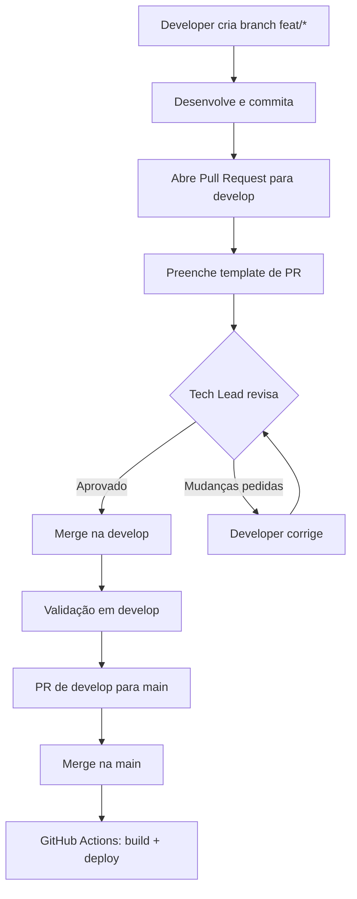

# :material-account-switch: Papéis e Rotações

Estrutura organizacional da equipe EdTech, com papéis definidos por função e plano de rotação para desenvolvimento full-stack.

---

## Composição da Equipe

- :material-crown: **Tech Lead**

    ---

    Coordenação técnica, arquitetura, revisão de PRs e mentoria da equipe.

    *Pedro Henrique P. Santos*

- :material-code-braces-box: **Full Stack 1**

    ---

    Desenvolvimento completo — frontend, backend, testes, infraestrutura e documentação conforme o ciclo de rotação vigente.

- :material-code-braces-box: **Full Stack 2**

    ---

    Desenvolvimento completo — frontend, backend, testes, infraestrutura e documentação conforme o ciclo de rotação vigente.

- :material-code-braces-box: **Full Stack 3**

    ---

    Desenvolvimento completo — frontend, backend, testes, infraestrutura e documentação conforme o ciclo de rotação vigente.

- :material-code-braces-box: **Full Stack 4**

    ---

    Desenvolvimento completo — frontend, backend, testes, infraestrutura e documentação conforme o ciclo de rotação vigente.

- :material-code-braces-box: **Full Stack 5**

    ---

    Desenvolvimento completo — frontend, backend, testes, infraestrutura e documentação conforme o ciclo de rotação vigente.

!!! info "Rotatividade"
    Os membros Full Stack alternam entre as frentes de trabalho (frontend, backend, QA, DevOps e Docs & Logs) a cada ciclo de rotação. A função não é vinculada a uma pessoa fixa — qualquer integrante pode assumir qualquer frente.

---

## Squads

Os integrantes são organizados em squads complementares para garantir cobertura de todas as frentes do projeto:

| Squad | Composição | Foco |
| :--- | :--- | :--- |
| :material-shield-check: **Qualidade e Rastreabilidade** | 2 Full Stacks | Testes, QA, documentação, logs e auditoria |
| :material-link-variant: **Integração** | 2 Full Stacks | Frontend-backend, APIs e fluxo de dados |
| :material-cog: **Arquitetura e Mentoria** | Tech Lead + 1 Full Stack | Infra, segurança, decisões técnicas e code review |

---

## Plano de Rotação

### Regras

- :material-calendar-sync: Cada ciclo dura **exatamente duas semanas**. A primeira rotação ocorreu hoje (12/06/2026).

- :material-rotate-3d-variant: Ao final de cada ciclo, cada membro **muda de frente de trabalho**
- :material-school: A rotação prioriza **aprendizado cruzado** entre produto, entrega, qualidade e operação

- :material-crown: O Tech Lead permanece fixo e atua na coordenação da progressão técnica e na revisão das trocas

### Ciclos de Rotação

### Exemplo de Rotação

| Função | Ciclo 1 | Ciclo 2 | Ciclo 3 | Ciclo 4 | Ciclo 5 |
| :--- | :---: | :---: | :---: | :---: | :---: |
| **Tech Lead** | Tech Lead | Tech Lead | Tech Lead | Tech Lead | Tech Lead |
| **Full Stack 1** | Frontend | Backend | QA | DevOps | Docs & Logs |
| **Full Stack 2** | Backend | Docs & Logs | Frontend | QA | DevOps |
| **Full Stack 3** | QA | DevOps | Docs & Logs | Frontend | Backend |
| **Full Stack 4** | DevOps | Frontend | Backend | Docs & Logs | QA |
| **Full Stack 5** | Docs & Logs | QA | DevOps | Backend | Frontend |

!!! tip "Flexibilidade"
    A tabela acima é uma **sugestão de progressão**. A rotação real será ajustada conforme o andamento do projeto e o feedback da equipe em cada retrospectiva.

---

## Objetivo da Rotação

!!! success "Visão Full-Stack"
    O objetivo é fazer com que cada pessoa desenvolva **visão ampla de produto e engenharia**, evitando especialização precoce demais.

    Ao longo das rotações, o time passa por **frontend, backend, QA, DevOps e observabilidade**, o que aumenta a formação de perfis mais completos e prepara o grupo para atuar com mais autonomia como futuros fullstacks.

---

## Processo de Pull Request

Todo código passa por um processo de revisão rigoroso antes de ser integrado a `develop` e, depois, promovido para
`main`:

---

## Checklist de Qualidade (PR Template)

Antes de solicitar revisão, todo PR deve cumprir:

### :material-shield-check: Código e Segurança

- [x] O código respeita o isolamento estrito de dados

- [x] Logs de auditoria foram implementados para esta funcionalidade

- [x] O código foi testado localmente sem comportamentos anômalos

- [x] **Nenhum dado sensível** exposto no código (chaves, credenciais, segredos)

### :material-test-tube: Testes e Documentação

- [x] Testes unitários (JUnit) criados ou atualizados

- [x] Documentação no MkDocs atualizada

- [x] Commits seguem a convenção (`feat`, `fix`, `docs`, `refactor`)

### :material-source-merge: Integração

- [x] Branch atualizada com a `main` e sem conflitos

- [x] Todos os passos do checklist validados manualmente

!!! quote "Compromisso"
    *"Ao submeter este PR, declaro que as políticas de qualidade do laboratório foram respeitadas e que a funcionalidade está pronta para ser auditada pelos tutores."*

---

## Comunicação

| Canal | Uso |
| :--- | :--- |
| **GitHub Issues** | Tarefas, bugs e melhorias |
| **GitHub PRs** | Revisão de código e discussões técnicas (assíncrono) |
| **Whatsapp** | Comunicação rápida e alinhamentos diários |
| **Discord** | Plannings e retrospectivas remotas |

---

## Histórico de Versões

| Versão |    Data    | Descrição                         | Autor                    |
| :---: | :---: | :--- | :--- |
| `1.0`  | 29/05/2026 | Criação do documento              | Pedro Henrique P. Santos |
| `1.1`  | 30/05/2026 | Processo de PR com branch develop | Pedro Henrique P. Santos |
| 1.2 | 13/06/2026 | Revisão técnica e reestruturação da documentação | Pedro Henrique P. Santos |
