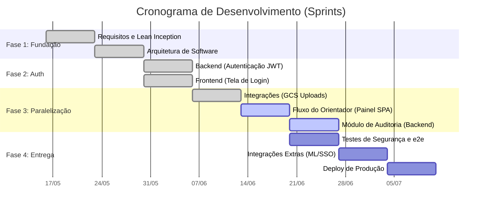
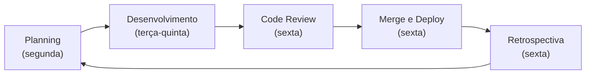
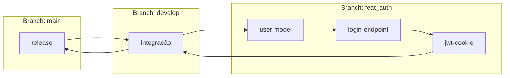

# :material-calendar-check: Cronograma e Sprints

Planejamento de desenvolvimento do EdTech, organizado em sprints semanais com entregas incrementais.

---

## Roadmap Geral



---

## Estrutura das Sprints

Cada sprint tem duração de **1 semana** e segue o ciclo:



---

## Fluxo de Desenvolvimento

### Branches

| Branch       | Propósito                    |         Proteção          |
|:-------------|:-----------------------------|:-------------------------:|
| `main`       | Branch estável de deploy     | :material-lock: Protegida |
| `develop`    | Integração e validação       | :material-lock: Protegida |
| `feat/*`     | Funcionalidades novas        |             —             |
| `fix/*`      | Correções de bugs            |             —             |
| `docs/*`     | Atualizações de documentação |             —             |
| `refactor/*` | Melhorias de código          |             —             |

!!! warning "Regra de Ouro"
    **Nunca commitar diretamente na `main`.** Todo fluxo passa por `develop` antes da integração final.

### Fluxo de uma Feature



---

## Convenção de Commits

Todos os commits devem seguir rigorosamente a especificação do **Conventional Commits**, facilitando a geração de *Changelogs* automáticos e clareza no histórico do Git:

| Tipo | Prefixo | Quando usar | Exemplo |
| :--- | :---: | :--- | :--- |
| Funcionalidade | `feat` | Uma nova funcionalidade ou regra de negócio | `feat: implement secure jwt cookie storage` |
| Correção | `fix` | Correção de um bug em produção ou staging | `fix: adjust spring security blocking path` |
| Documentação | `docs` | Alterações exclusivas na documentação (MkDocs, README) | `docs: update adr 0009 mkdocs format` |
| Estilo | `style` | Ajustes de formatação que não afetam a lógica (espaçamento, aspas) | `style: format java classes with spotless` |
| Refatoração | `refactor` | Melhoria estrutural de código que não corrige bug nem cria feature | `refactor: optimize postgresql connection pooling` |
| Performance | `perf` | Mudança de código que especificamente melhora a performance | `perf: add caching to document query` |
| Testes | `test` | Adição ou correção de testes (unitários, integração, e2e) | `test: add junit cases for jwt validation` |
| Build | `build` | Alterações que afetam o build system ou dependências externas (npm, maven) | `build: update spring boot version to 3.2.0` |
| Integração (CI) | `ci` | Alterações nos scripts e configurações de CI/CD (GitHub Actions) | `ci: add workflow for running frontend tests` |
| Tarefas | `chore` | Manutenções de rotina, scripts secundários ou atualizações pequenas | `chore: update .gitignore with IDE files` |

!!! example "Formato completo"
    ```text
    tipo(escopo-opcional): descrição curta em inglês e no imperativo

    Corpo opcional explicando o *por que* e *o que* mudou, em detalhes.
    
    Refs: #numero-da-issue
    ```

---

## Marcos do Projeto

| Marco | Data Prevista | Status |
| :--- | :---: | :---: |
| **S1:** Setup completo (repo, infra, docs) | 16/05 | :material-check-circle:{ .green } Concluído |
| **S2:** Lean Inception e Arquitetura fechados | 23/05 | :material-check-circle:{ .green } Concluído |
| **S3:** Autenticação funcional (API + Frontend) | 30/05 | :material-check-circle:{ .green } Concluído |
| **S4:** GCS Uploads & Base do Orientador | 06/06 | :material-check-circle:{ .green } Concluído |
| **S5:** Painel Concluído & Auditoria Integrada | 13/06 | :material-check-circle:{ .green } Concluído |
| **S6:** Bateria de Testes e2e & Integrações ML | 20/06 | :material-check-circle:{ .green } Concluído |
| **S7:** Homologação Final e Deploy de Produção | 27/06 | :material-check-circle:{ .green } Concluído |
| **S8:** Platform Engineering, Segurança Adicional e IaC | 04/07 | :material-progress-clock: Em andamento |


---

## Histórico de Versões

| Versão |    Data    | Descrição                           | Autor                    |
| :---: | :---: | :--- | :--- |
| `1.0`  | 29/05/2026 | Criação do documento                | Pedro Henrique P. Santos |
| `1.1`  | 30/05/2026 | Fluxo atualizado com branch develop | Pedro Henrique P. Santos |
| `1.2` | 13/06/2026 | Revisão técnica e reestruturação da documentação | Pedro Henrique P. Santos |
| `2.0.0` | 04/07/2026 | Revisão profunda, correção de metadados e melhorias visuais | Pedro Henrique P. Santos |

