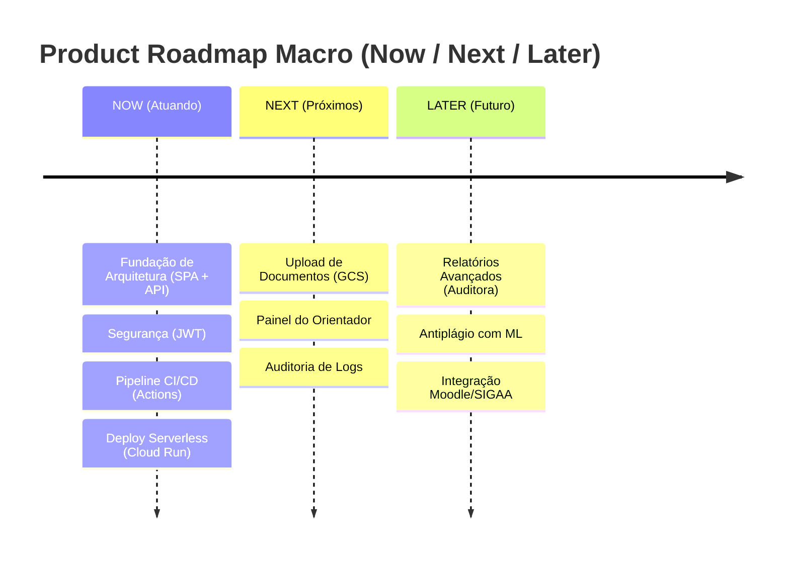

---
title: 'Product Roadmap (Now / Next / Later)'
---

# :material-map-legend: Product Roadmap (Now / Next / Later)

Na EdTech, adotamos o framework **Now / Next / Later** para guiar a evolução macro do desenvolvimento sem cair na armadilha do microgerenciamento de cronograma.

##  NOW (Atuando Agora)
**Foco:** Fundações de arquitetura, segurança, estabilidade do MVP e Integração Contínua.

- Configuração de CI/CD via GitHub Actions e infraestrutura Serverless no Google Cloud Run (`ADR 0003`, `ADR 0008`).

- Setup da API REST em Spring Boot (`ADR 0005`) separada do Frontend SPA em React (`ADR 0006`).

- Implementação da Autenticação via JWT com cookies HttpOnly para proteção contra XSS (`ADR 0002`).

- Setup do cluster PostgreSQL e versionamento de esquema com Flyway (`ADR 0004`, `ADR 0007`).

- Estabelecimento do Docs-as-Code com MkDocs (`ADR 0009`).

##  NEXT (Próximos Passos)
**Foco:** Completude do Fluxo de Usuário (Pesquisador e Orientador) com o armazenamento funcional.

- Integração completa ao Google Cloud Storage (`ADR 0001`) para upload seguro de artigos e relatórios (Alana).

- Dashboard de acompanhamento e validação de submissões para Orientadores/Administradores (Arthur).

- Geração da base de `audit_logs` inalterável, cobrindo todos os eventos sensíveis do sistema (Mariana).

##  LATER (Futuro)
**Foco:** Visão expandida, integrações e inteligência.

- Relatórios automatizados (exportação CSV/PDF) para a auditoria de acesso.

- Suporte experimental a Machine Learning para classificar a similaridade dos Artigos Submetidos (Antiplágio interno).

- Integração de single sign-on (SSO) com outros sistemas universitários institucionais (ex: Moodle, SIGAA).

---

## Histórico de Versões

| Versão | Data | Descrição | Autor |
| :---: | :---: | :--- | :--- |
| `1.0` | 30/05/2026 | Substituição de Gantt Acadêmico pelo Now/Next/Later | Pedro Henrique P. Santos |
| `1.1` | 04/06/2026 | Atualização refletindo novas ADRs e prioridades arquiteturais | Pedro Henrique P. Santos |
| `1.2` | 13/06/2026 | Revisão técnica e reestruturação da documentação | Pedro Henrique P. Santos |

