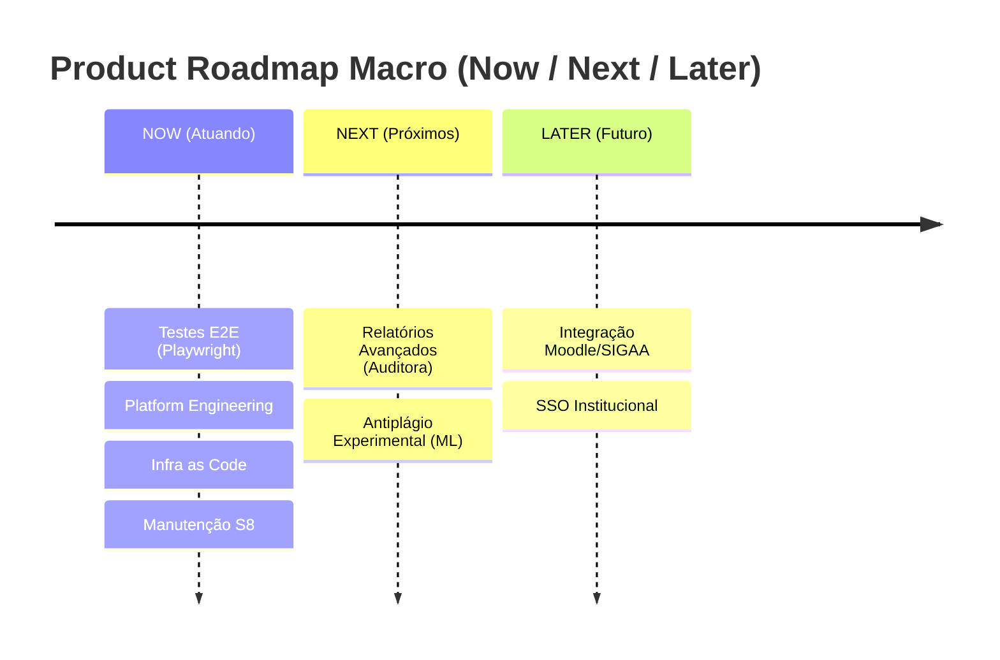

# :material-map-legend: Product Roadmap (Now / Next / Later)

Na EdTech, adotamos o framework **Now / Next / Later** para guiar a evolução macro do desenvolvimento sem cair na armadilha do microgerenciamento de cronograma.

##  NOW (Atuando Agora - Sprint 8)
**Foco:** Engenharia de Plataforma, automação total de testes e estabilidade.

- Configuração final de Testes E2E via Playwright (`ADR 0010`).

- Refinamentos na documentação arquitetural e DevOps.

- Monitoramento ativo de segurança e correções de dívida técnica.

##  NEXT (Próximos Passos)
**Foco:** Ferramentas Avançadas e Automação de Análises.

- Criação de relatórios automatizados (exportação CSV/PDF) para a auditoria de acesso.

- Suporte experimental a Machine Learning para classificar a similaridade dos Artigos Submetidos (Antiplágio interno).

##  LATER (Futuro)
**Foco:** Visão expandida, integrações e inteligência.

- Relatórios automatizados (exportação CSV/PDF) para a auditoria de acesso.

- Suporte experimental a Machine Learning para classificar a similaridade dos Artigos Submetidos (Antiplágio interno).

- Integração de single sign-on (SSO) com outros sistemas universitários institucionais (ex: Moodle, SIGAA).

---

## Histórico de Versões

| Versão | Data | Descrição | Autor |
| :---: | :---: | :--- | :--- |
| `1.0` | 30/05/2026 | Substituição de Gantt Acadêmico pelo Now/Next/Later | Pedro Henrique P. Santos |
| `1.1` | 04/06/2026 | Atualização refletindo novas ADRs e prioridades arquiteturais | Pedro Henrique P. Santos |
| `1.2` | 13/06/2026 | Revisão técnica e reestruturação da documentação | Pedro Henrique P. Santos |
| `2.0.0` | 04/07/2026 | Revisão profunda, correção de metadados e melhorias visuais | Pedro Henrique P. Santos |

