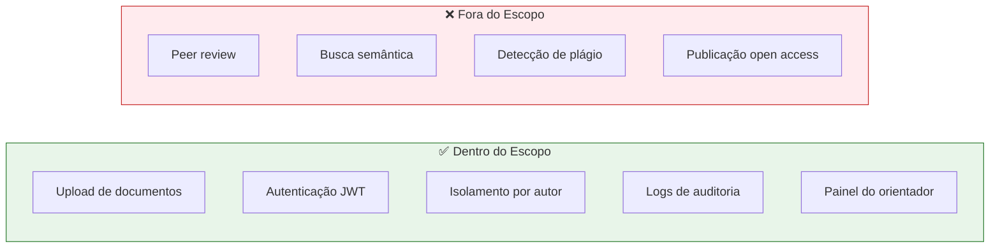

# :material-compare-horizontal: É / Não É / Faz / Não Faz

Alinhamento de expectativas sobre os limites e o escopo do EdTech.

---

## Matriz de Classificação

=== ":material-check-circle: É"

    - Um repositório acadêmico digital
    - Uma plataforma web para centralização de documentos científicos
    - Um sistema com autenticação segura e isolamento de dados
    - Uma ferramenta de auditoria e rastreabilidade
    - Um projeto acadêmico do AILAB Makers (UnB FCTE)

=== ":material-close-circle: Não É"

    - Uma rede social acadêmica
    - Um sistema de avaliação de artigos (peer review)
    - Uma plataforma de publicação aberta (open access)
    - Um editor de texto ou LaTeX online
    - Um sistema de gestão de currículo Lattes

=== ":material-cog: Faz"

    - Upload e download de PDFs, relatórios e datasets
    - Autenticação segura com JWT em cookies HttpOnly
    - Isolamento de documentos por pesquisador e projeto
    - Registro de logs de auditoria inalteráveis
    - Listagem filtrada de documentos por autor
    - Validação e aprovação de submissões pelo orientador

=== ":material-cancel: Não Faz"

    - Busca semântica no conteúdo dos documentos
    - Processamento de linguagem natural nos artigos
    - Detecção de plágio
    - Indexação em bases como Scopus ou Web of Science
    - Hospedagem de repositórios de código
    - Videoconferência ou chat entre pesquisadores

---

## Diagrama de Fronteiras

---

## Histórico de Versões

| Versão | Data | Descrição | Autor |
| :---: | :---: | :--- | :--- |
| `1.0` | 29/05/2026 | Criação do documento | Pedro Henrique P. Santos |
