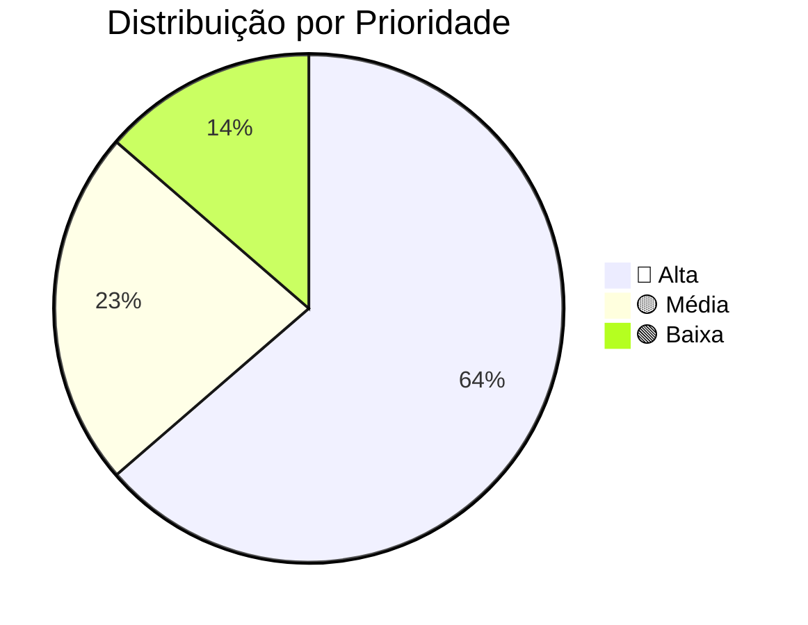
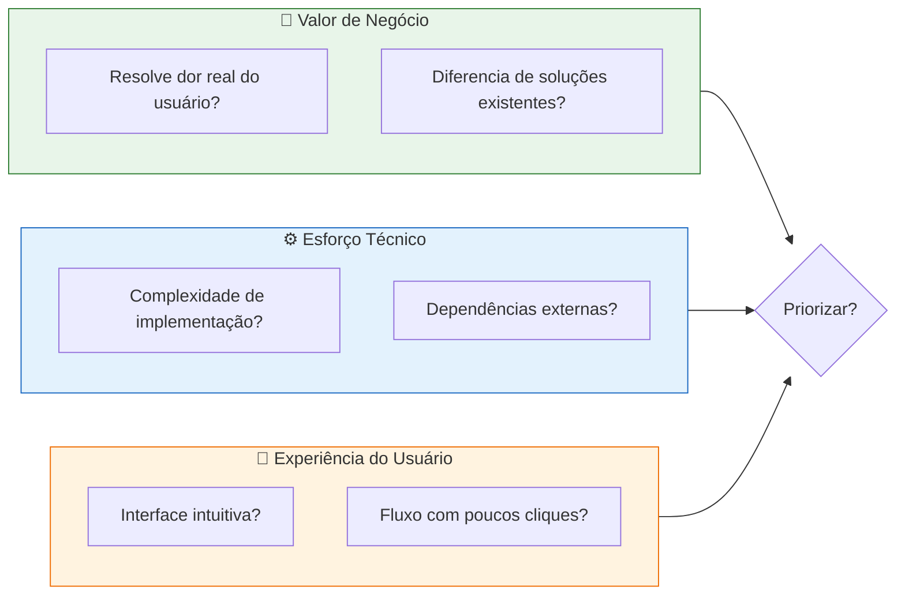

# :material-lightbulb-on-10: Brainstorming de Funcionalidades

Levantamento de todas as funcionalidades discutidas pela equipe, categorizadas por módulo e priorizadas para o MVP.

---

## Funcionalidades Levantadas

### :material-shield-lock: Autenticação e Segurança

| # | Funcionalidade | Persona | Prioridade | Sprint |
| :---: | :--- | :---: | :---: | :---: |
| F01 | Cadastro de pesquisador com e-mail institucional | Ana | 🔴 Alta | Sprint 2 |
| F02 | Login com JWT em cookie `HttpOnly` + `Secure` | Todos | 🔴 Alta | Sprint 2 |
| F03 | Logout com invalidação do cookie | Todos | 🔴 Alta | Sprint 2 |
| F04 | Filtro de autenticação no Spring Security | Todos | 🔴 Alta | Sprint 2 |
| F05 | Tratamento de token expirado | Todos | 🟡 Média | Sprint 3 |
| F06 | Recuperação de senha por e-mail | Ana | 🟢 Baixa | Backlog |

### :material-file-upload: Upload e Documentos

| # | Funcionalidade | Persona | Prioridade | Sprint |
| :---: | :--- | :---: | :---: | :---: |
| F07 | Upload de PDF com metadados | Ana | 🔴 Alta | Sprint 3 |
| F08 | Upload de datasets (CSV, JSON) | Ana | 🟡 Média | Sprint 3 |
| F09 | Armazenamento no Google Cloud Storage | Ana | 🔴 Alta | Sprint 3 |
| F10 | Listagem de documentos filtrada por autor | Ana | 🔴 Alta | Sprint 3 |
| F11 | Download de documentos próprios | Ana | 🔴 Alta | Sprint 3 |
| F12 | Exclusão de rascunhos pelo autor | Ana | 🟡 Média | Sprint 4 |

### :material-account-supervisor: Orientador e Isolamento

| # | Funcionalidade | Persona | Prioridade | Sprint |
| :---: | :--- | :---: | :---: | :---: |
| F13 | Painel de projetos do orientador | Carlos | 🔴 Alta | Sprint 4 |
| F14 | Visualização de documentos dos orientandos | Carlos | 🔴 Alta | Sprint 4 |
| F15 | Isolamento estrito por `project_members` | Carlos | 🔴 Alta | Sprint 4 |
| F16 | Aprovação/rejeição de submissões | Carlos | 🟡 Média | Sprint 5 |
| F17 | Notificação de nova submissão | Carlos | 🟢 Baixa | Backlog |

### :material-clipboard-text-clock: Auditoria

| # | Funcionalidade | Persona | Prioridade | Sprint |
| :---: | :--- | :---: | :---: | :---: |
| F18 | Log de login/logout | Márcia | 🔴 Alta | Sprint 2 |
| F19 | Log de uploads e downloads | Márcia | 🔴 Alta | Sprint 3 |
| F20 | Log de tentativas de acesso negado | Márcia | 🔴 Alta | Sprint 4 |
| F21 | Consulta de logs com filtros | Márcia | 🟡 Média | Sprint 5 |
| F22 | Exportação de relatórios de auditoria | Márcia | 🟢 Baixa | Backlog |

---

## Gráfico de Priorização

---

## Revisão Técnica, de Negócio e de UX

Cada funcionalidade foi avaliada em três dimensões:

---

## Histórico de Versões

| Versão | Data | Descrição | Autor |
| :---: | :---: | :--- | :--- |
| `1.0` | 29/05/2026 | Criação do documento | Pedro Henrique P. Santos |
