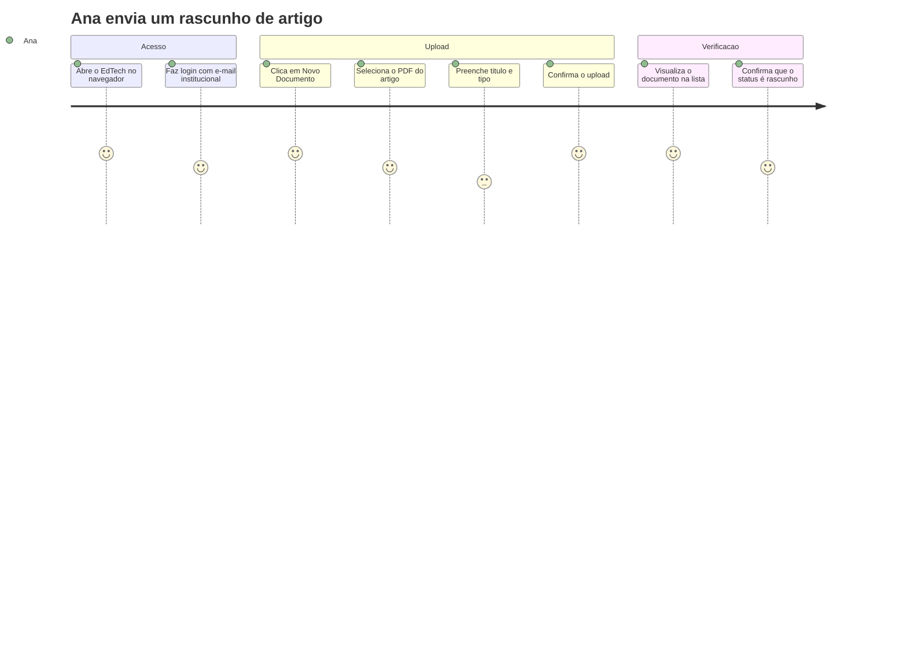
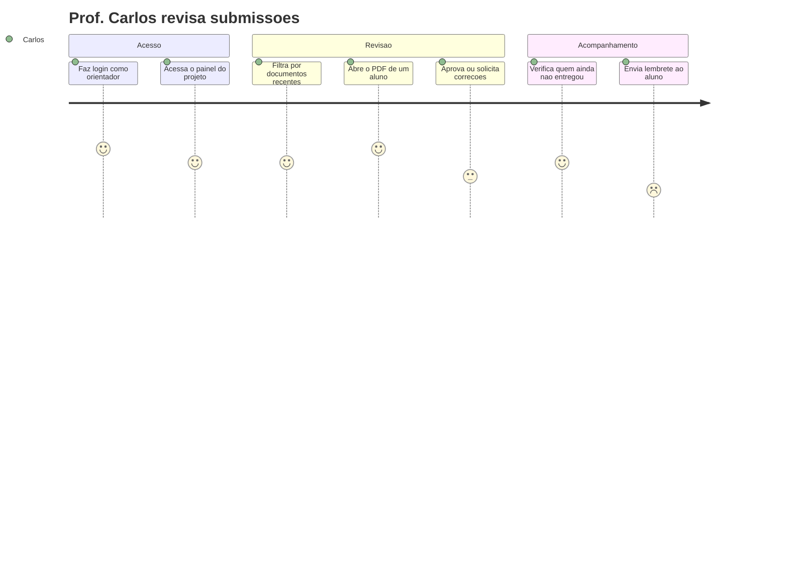
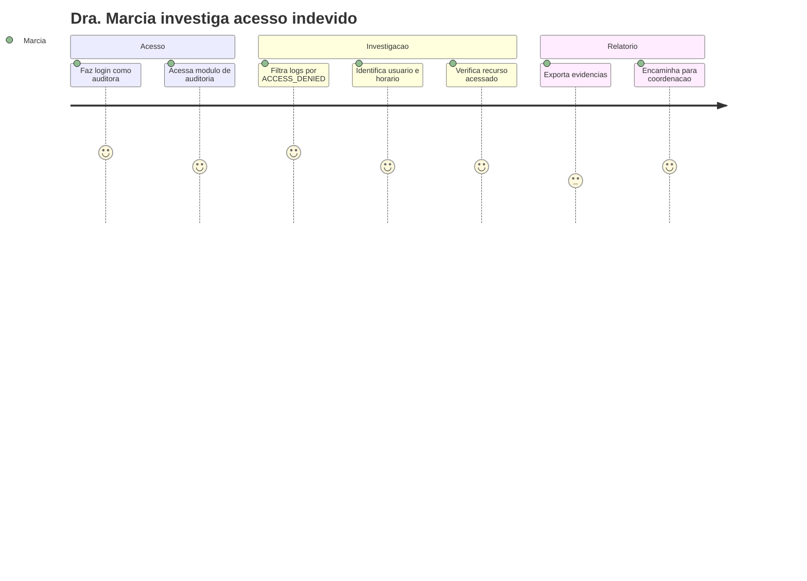

# :material-map-marker-path: Jornadas de Usuário

Fluxos principais que cada persona percorre ao utilizar o EdTech, desde o primeiro acesso até a conclusão da tarefa.

---

## Jornada 1 — Ana envia um artigo

**Persona:** Ana (Pesquisadora de IC)
**Objetivo:** Fazer upload de um rascunho de artigo no sistema

| Etapa | Ação | Sentimento | Ponto de atenção |
| :---: | :--- | :---: | :--- |
| 1 | Acessa o sistema | 😊 | URL deve ser fácil de lembrar |
| 2 | Faz login | 😐 | Formulário claro com feedback de erro |
| 3 | Inicia upload | 😊 | Botão visível e intuitivo |
| 4 | Preenche metadados | 😕 | Campos obrigatórios devem ser mínimos |
| 5 | Confirma upload | 😊 | Feedback visual de sucesso |
| 6 | Verifica na lista | 😊 | Documento aparece imediatamente |

---

## Jornada 2 — Prof. Carlos revisa submissões

**Persona:** Prof. Carlos (Orientador)
**Objetivo:** Verificar quais alunos já entregaram o relatório semanal

| Etapa | Ação | Sentimento | Ponto de atenção |
| :---: | :--- | :---: | :--- |
| 1 | Login | 😊 | Acesso rápido ao painel |
| 2 | Visualiza projeto | 😊 | Lista clara de orientandos |
| 3 | Filtra documentos | 😐 | Filtros por data e status |
| 4 | Revisa documento | 😊 | Visualização inline ou download |
| 5 | Aprova/rejeita | 😕 | Feedback claro de status *(planejado)* |

---

## Jornada 3 — Dra. Márcia investiga acesso

**Persona:** Dra. Márcia (Auditora)
**Objetivo:** Verificar se houve tentativa de acesso indevido a documentos de outro laboratório

| Etapa | Ação | Sentimento | Ponto de atenção |
| :---: | :--- | :---: | :--- |
| 1 | Login | 😊 | Acesso restrito ao módulo de auditoria |
| 2 | Filtra logs | 😊 | Filtros por ação, data e usuário |
| 3 | Analisa detalhes | 😐 | IP, user-agent e timestamp claros |
| 4 | Exporta dados | 😕 | Formato adequado *(planejado)* |
