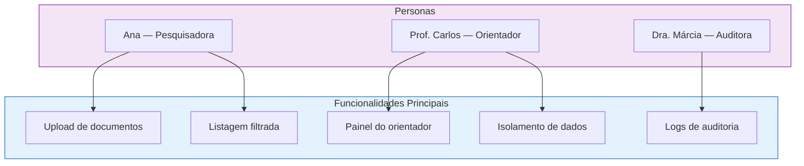

# :material-account-group: Personas

Perfis representativos dos usuários do EdTech, criados para guiar decisões de design e priorização de funcionalidades.

---

## Personas do Sistema

- :material-flask: **Ana — Pesquisadora de IC**

    ---

    **Idade:** 21 anos · **Semestre:** 5º · **Curso:** Engenharia de Software

    **Contexto:** Participa de um grupo de iniciação científica e precisa armazenar rascunhos de artigos, datasets de experimentos e relatórios parciais de forma organizada. Atualmente usa Google Drive pessoal, sem controle de versão ou auditoria.

    **Necessidades:**

    - [x] Upload fácil de PDFs e datasets
    - [x] Visualizar apenas seus próprios documentos
    - [x] Saber que seus rascunhos estão seguros e privados
    - [ ] Solicitar revisão do orientador

    **Frustrações:**

    - Perder arquivos em pastas desorganizadas
    - Não saber se o orientador já viu o documento
    - Medo de que colegas acessem rascunhos inacabados

- :material-school: **Prof. Carlos — Orientador**

    ---

    **Idade:** 45 anos · **Titulação:** Doutor · **Área:** Inteligência Artificial

    **Contexto:** Orienta 8 alunos de IC e mestrado em 3 projetos diferentes. Precisa acompanhar o progresso de cada pesquisador sem ter que pedir documentos por e-mail ou WhatsApp.

    **Necessidades:**

    - [x] Ver documentos de todos os orientandos vinculados
    - [x] Acompanhar submissões e validar entregas
    - [x] Ter acesso restrito apenas aos seus projetos
    - [ ] Painel com métricas do laboratório

    **Frustrações:**

    - E-mails com múltiplas versões do mesmo artigo
    - Não saber qual aluno já entregou o relatório
    - Risco de acessar dados de outros laboratórios

- :material-shield-search: **Dra. Márcia — Auditora Institucional**

    ---

    **Idade:** 38 anos · **Cargo:** Coordenadora de Compliance · **Setor:** Pró-Reitoria

    **Contexto:** Responsável por garantir a integridade dos processos acadêmicos. Precisa verificar quem acessou o quê, quando e de onde, especialmente em casos de disputa de autoria ou suspeita de vazamento.

    **Necessidades:**

    - [x] Consultar logs de todas as ações do sistema
    - [x] Verificar tentativas de acesso negado
    - [x] Rastrear histórico de uploads e downloads
    - [ ] Exportar relatórios de auditoria

    **Frustrações:**

    - Sistemas sem rastro de quem fez o quê
    - Ter que solicitar logs para a equipe de TI
    - Falta de evidências em processos disciplinares

---

## Mapa de Personas × Funcionalidades

---

## Histórico de Versões

| Versão | Data | Descrição | Autor |
| :---: | :---: | :--- | :--- |
| `1.0` | 29/05/2026 | Criação do documento | Pedro Henrique P. Santos |
