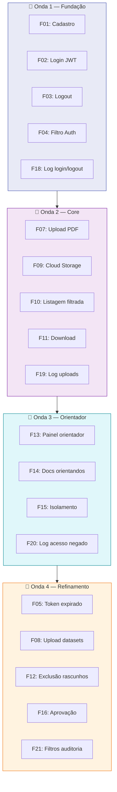

# :material-view-sequential: Sequenciador de Funcionalidades

Organização das funcionalidades em ondas de entrega, respeitando dependências técnicas e valor de negócio.

---

## Regras do Sequenciador

!!! info "Critérios de ordenação"
    1. **Cada onda** deve ter no máximo **3 funcionalidades** de alta complexidade
    2. **Dependências** técnicas determinam a ordem entre ondas
    3. Funcionalidades de **maior valor** e **menor esforço** vêm primeiro
    4. O **MVP** é composto pelas **Ondas 1 e 2**

---

## Ondas de Entrega

---

## Detalhamento por Onda

### :material-numeric-1-circle: Onda 1 — Fundação (Sprint 2)

| Funcionalidade | Esforço | Valor | Responsável |
| :--- | :---: | :---: | :---: |
| F01: Cadastro de pesquisador | Médio | Alto | Full Stack (Backend) |
| F02: Login com JWT | Alto | Alto | Full Stack (Backend) |
| F03: Logout com invalidação | Baixo | Alto | Full Stack (Backend) |
| F04: Filtro de autenticação | Alto | Alto | Full Stack (Backend) + Tech Lead |
| F18: Log de login/logout | Baixo | Médio | Full Stack (Docs & Logs) |

### :material-numeric-2-circle: Onda 2 — Core (Sprint 3)

| Funcionalidade | Esforço | Valor | Responsável |
| :--- | :---: | :---: | :---: |
| F07: Upload de PDF | Médio | Alto | Full Stack (Backend) |
| F09: Integração GCS | Alto | Alto | Full Stack (DevOps) |
| F10: Listagem filtrada | Médio | Alto | Full Stack (Frontend + Backend) |
| F11: Download de documentos | Baixo | Alto | Full Stack (Backend) |
| F19: Log de uploads | Baixo | Médio | Full Stack (Docs & Logs) |

### :material-numeric-3-circle: Onda 3 — Orientador (Sprint 4)

| Funcionalidade | Esforço | Valor | Responsável |
| :--- | :---: | :---: | :---: |
| F13: Painel do orientador | Alto | Alto | Full Stack (Frontend) |
| F14: Visualização de docs | Médio | Alto | Full Stack (Frontend + Backend) |
| F15: Isolamento por projeto | Alto | Alto | Full Stack (Backend) + Tech Lead |
| F20: Log de acesso negado | Baixo | Médio | Full Stack (Docs & Logs) |

### :material-numeric-4-circle: Onda 4 — Refinamento (Sprint 5)

| Funcionalidade | Esforço | Valor | Responsável |
| :--- | :---: | :---: | :---: |
| F05: Token expirado | Baixo | Médio | Full Stack (Backend) |
| F08: Upload de datasets | Baixo | Médio | Full Stack (Backend) |
| F12: Exclusão de rascunhos | Baixo | Médio | Full Stack (Backend) |
| F16: Aprovação de submissões | Médio | Médio | Full Stack (Frontend + Backend) |
| F21: Filtros de auditoria | Médio | Médio | Full Stack (QA) |

---

## Histórico de Versões

| Versão | Data | Descrição | Autor |
| :---: | :---: | :--- | :--- |
| `1.0` | 29/05/2026 | Criação do documento | Pedro Henrique P. Santos |
