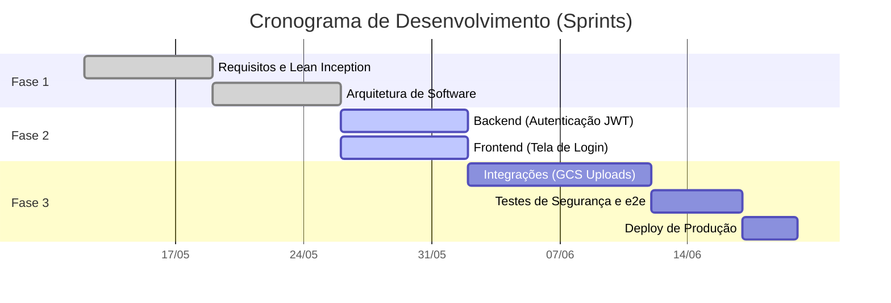
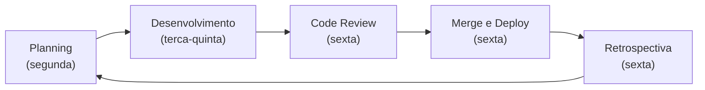
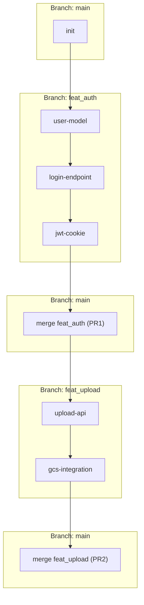

# :material-calendar-check: Cronograma e Sprints

Planejamento de desenvolvimento do EdTech, organizado em sprints semanais com entregas incrementais.

---

## Roadmap Geral



---

## Estrutura das Sprints

Cada sprint tem duração de **1 semana** e segue o ciclo:



---

## Fluxo de Desenvolvimento

### Branches

| Branch | Propósito | Proteção |
| :--- | :--- | :---: |
| `main` | Branch estável de deploy | :material-lock: Protegida |
| `feat/*` | Funcionalidades novas | — |
| `fix/*` | Correções de bugs | — |
| `docs/*` | Atualizações de documentação | — |
| `refactor/*` | Melhorias de código | — |

!!! warning "Regra de Ouro"
    **Nunca commitar diretamente na `main`.** Toda integração ocorre exclusivamente via Pull Requests revisados pela liderança técnica.

### Fluxo de uma Feature



---

## Convenção de Commits

Todos os commits seguem o padrão **Conventional Commits** para rastreabilidade:

| Tipo | Prefixo | Quando usar | Exemplo |
| :--- | :---: | :--- | :--- |
| Funcionalidade | `feat` | Nova feature | `feat: implement secure jwt cookie storage` |
| Correção | `fix` | Bug fix | `fix: adjust spring security blocking path` |
| Documentação | `docs` | Docs somente | `docs: update mkdocs architecture guides` |
| Refatoração | `refactor` | Melhoria sem mudar comportamento | `refactor: optimize postgresql connection pooling` |

!!! example "Formato completo"
    ```
    tipo: descrição curta em inglês (imperativo)

    Corpo opcional com mais detalhes sobre a mudança.

    Refs: #issue-number
    ```

---

## Marcos do Projeto

| Marco | Data Prevista | Status |
| :--- | :---: | :---: |
| **S1:** Setup completo (repo, infra, docs) | 18/05 | :material-check-circle:{ .green } Concluído |
| **S2:** Lean Inception e Arquitetura fechados | 25/05 | :material-check-circle:{ .green } Concluído |
| **S3:** Autenticação funcional (API + Frontend) | 01/06 | :material-progress-clock: Em andamento |
| **S4:** Upload de documentos no GCS | 08/06 | :material-circle-outline: Pendente |
| **S5:** Fluxo do Orientador, Auditoria e Deploy | 15/06 | :material-circle-outline: Pendente |


---

## Histórico de Versões

| Versão | Data | Descrição | Autor |
| :---: | :---: | :--- | :--- |
| `1.0` | 29/05/2026 | Criação do documento | Pedro Henrique P. Santos |
