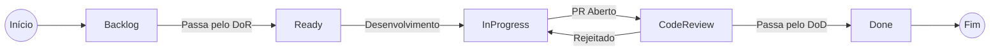

# :material-check-all: DoR & DoD (Critérios de Aceite)

Para garantir a qualidade nas entregas ágeis do projeto EdTech, substituímos pesados checklists de inspeção e Casos de Uso por contratos claros de transição de status para as Histórias de Usuário.

## Definition of Ready (DoR)

Uma História de Usuário (`User Story`) ou Tarefa apenas entra no Sprint (Muda para a coluna **To Do / Ready for Dev**) quando cumpre os seguintes requisitos mínimos de planejamento:

1. **Clareza de Valor:** A história segue o formato "Como [Persona], Quero [Ação], Para Que [Benefício]".
2. **Critérios de Aceitação:** Possui pelo menos um cenário de teste comportamental validado (ex: "Dado que sou Ana, Quando clico no envio, Então o status muda para Draft").
3. **Dependências Mapeadas:** Quaisquer bloqueios com outras equipes (ex: aprovação de design do Figma, criação de infraestrutura de banco de dados) já estão resolvidos.
4. **Estimada:** A equipe compreende a complexidade da tarefa e a pontuou (Story Points ou T-Shirt Sizes).

## Definition of Done (DoD)

Uma funcionalidade desenvolvida só pode ser dada como concluída (Muda para **Done / Produção**) se passar pelo rigor técnico abaixo:

1. **Código Funcional:** O código atende a 100% dos Critérios de Aceitação descritos no ticket.
2. **Revisão de Pares (Code Review):** O Pull Request (PR) foi aprovado por pelo menos 1 (um) engenheiro sênior da equipe.
3. **Testes Automatizados:** O código novo não quebra testes existentes e as novas lógicas de negócio possuem cobertura de testes (Unitários ou Integração).
4. **Integração Contínua (CI):** A pipeline do GitHub Actions foi finalizada com sucesso (Lint e Testes).
5. **Critérios Não Funcionais Atendidos:** Nenhuma credencial foi comitada e a performance das rotas afetadas continua dentro das metas.

---

## Histórico de Versões

| Versão | Data | Descrição | Autor |
| :---: | :---: | :--- | :--- |
| `1.0` | 30/05/2026 | Definição inicial do DoR e DoD do projeto | Pedro Henrique P. Santos |
