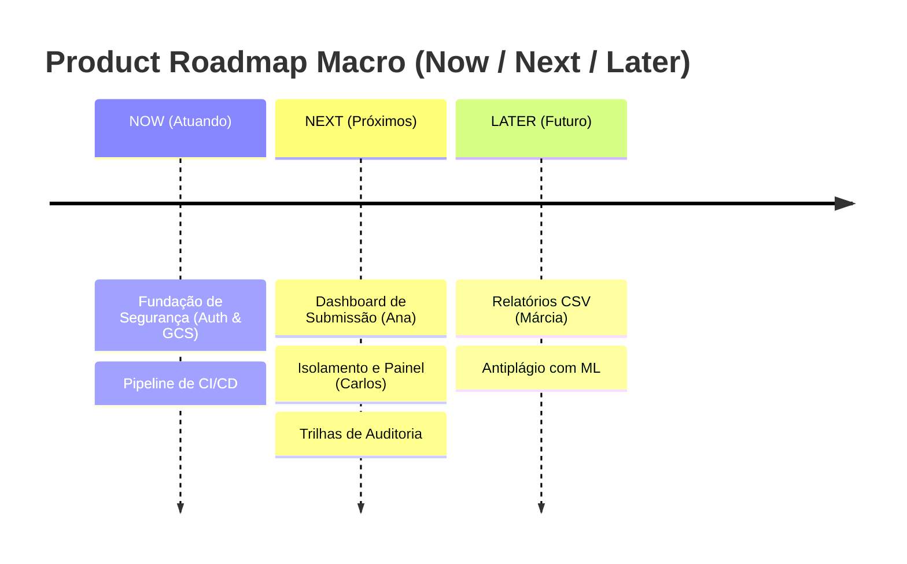

# :material-map-legend: Product Roadmap (Now / Next / Later)

Gantt Charts com datas fictícias geralmente geram quebras de expectativa na indústria ágil. O repasse de "Semanas de Entrega" não traduz o valor que o produto está ganhando.
Na EdTech, adotamos o framework **Now / Next / Later** para guiar a evolução macro do desenvolvimento sem cair na armadilha do microgerenciamento de cronograma.

## 🟢 NOW (Atuando Agora)
**Foco:** Fundações de segurança, estabilidade do MVP e Integração Contínua.

- Setup do cluster PostgreSQL + Integração ao Google Cloud Storage (`ADR 0001`).
- Endpoint unificado de Autenticação com regras restritas para o domínio `@instituicao.edu.br`.
- Configuração do pipeline de CI (Linter de Markdown, Testes unitários rodando no GitHub Actions).

## 🟡 NEXT (Próximos Passos)
**Foco:** Completude do Fluxo de Usuário após a estabilidade da infraestrutura.

- Tela do Dashboard da Ana (Upload, Tracking de Status de `Draft` para `Submitted`).
- Árvore de visualização de subprojetos no Painel do Carlos.
- Geração da base do `audit_logs` nas transações.

## 🔴 LATER (Futuro)
**Foco:** Visão expandida, métricas de negócio e melhorias visuais.

- Relatórios automatizados em CSV para a Márcia (Auditora).
- Modo escuro de interface e Microinterações baseadas no Figma.
- Suporte experimental a Machine Learning para classificar a similaridade dos Artigos Submetidos (Antiplágio interno).

---

## Histórico de Versões

| Versão | Data | Descrição | Autor |
| :---: | :---: | :--- | :--- |
| `1.0` | 30/05/2026 | Substituição de Gantt Acadêmico pelo Now/Next/Later | Pedro Henrique P. Santos |
