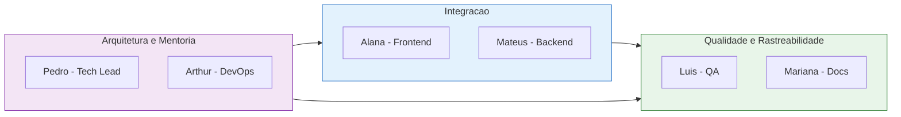
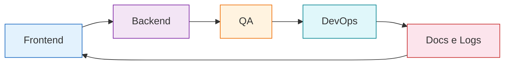
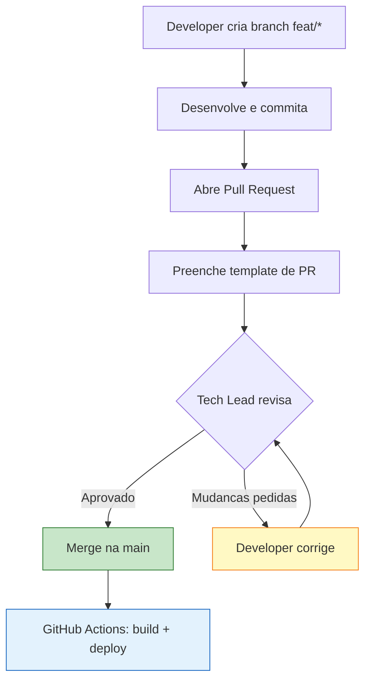

# :material-account-switch: Papéis e Rotações

Estrutura organizacional da equipe EdTech, com alocações estratégicas baseadas no perfil de cada integrante e plano de rotação para desenvolvimento full-stack.

---

## Posições Atuais

- :material-crown: **Pedro Henrique P. Santos**

    ---

    **Tech Lead** — Coordenação técnica, arquitetura, revisão de PRs e mentoria da equipe.

- :material-monitor-dashboard: **Alana Cristyna F. Dias**

    ---

    **Frontend** — Interface web, consumo de APIs e experiência do usuário.

- :material-server-network: **Arthur Carvalho Leite**

    ---

    **DevOps** — Infraestrutura, deploy, automação e proteção da aplicação.

- :material-test-tube: **Luis Gustavo F. Nunes**

    ---

    **QA** — Testes, validações, automação de cenários e garantia de qualidade.

- :material-file-document-edit: **Mariana S. F. Andrade**

    ---

    **Docs & Logs** — Documentação técnica, estruturação de logs e telemetria.

- :material-code-braces: **Mateus Alves Araújo**

    ---

    **Backend** — Lógica de negócio, serviços REST e modelagem de dados.

---

## Squads

Os integrantes são organizados em squads complementares para garantir cobertura de todas as frentes do projeto:

| Squad | Integrantes | Foco |
| :--- | :--- | :--- |
| :material-shield-check: **Qualidade e Rastreabilidade** | Luís + Mariana | Testes, QA, documentação, logs e auditoria |
| :material-link-variant: **Integração** | Alana + Mateus | Frontend-backend, APIs e fluxo de dados |
| :material-cog: **Arquitetura e Mentoria** | Pedro + Arthur | Infra, segurança, decisões técnicas e code review |

---

## Justificativa das Alocações

??? note "Arthur — DevOps"
    Arthur é o membro com perfil acadêmico mais avançado e o que apresenta maior experiência prática, especialmente em **cibersegurança, backend e integração**. Esse histórico o torna um bom candidato para lidar com infraestrutura, deploy, automação e proteção da aplicação. Além disso, o domínio em Java e Spring Boot facilita a relação entre código, ambiente e entrega.

??? note "Alana — Frontend"
    Alana é a única integrante que já relatou contato prévio com **HTML**, o que a coloca naturalmente mais próxima da camada visual. Como seu interesse principal está em dados, o papel em frontend pode ampliar sua visão de produto e reforçar a lógica necessária para consumir APIs. O fato de estar no terceiro semestre também favorece uma curva de aprendizado consistente nessa frente.

??? note "Mateus — Backend"
    Mateus declarou interesse principal em backend e possui base em **Java, POO e fundamentos em estruturas de dados**. Isso o coloca em uma posição adequada para evoluir na construção de lógica de negócio, organização de serviços e modelagem inicial de dados. O papel também combina com seu estágio acadêmico, que ainda está em formação, mas já com boa direção técnica.

??? note "Luís — QA"
    Luís possui exposição a várias linguagens, incluindo **C, C++, C#, Java e Python**, o que tende a favorecer leitura de código e adaptação a diferentes contextos. Esse perfil é útil para testes, validações e automação de cenários, inclusive em uma linha que pode conversar com segurança. Embora o interesse principal dele seja backend e jogos, QA pode ampliar bastante sua visão de produto e qualidade.

??? note "Mariana — Docs & Logs"
    Mariana está no segundo semestre e ainda constrói sua base técnica, mas já demonstra interesse em **dados e IA**. Essa combinação ajuda na organização de informações, documentação técnica e estruturação de logs e telemetria de forma clara. O contato com bibliotecas de dados em Python pode ser útil para transformar dados de execução em material de monitoramento e auditoria.

---

## Plano de Rotação

### Regras

- :material-calendar-sync: Cada ciclo dura aproximadamente **duas semanas**
- :material-rotate-3d-variant: Ao final de cada ciclo, cada membro **muda de papel**
- :material-school: A rotação prioriza **aprendizado cruzado** entre produto, entrega, qualidade e operação
- :material-crown: Pedro permanece como **Tech Lead** e atua na coordenação da progressão técnica e na revisão das trocas

### Ciclos de Rotação

### Exemplo de Rotação

| Membro | Ciclo 1 | Ciclo 2 | Ciclo 3 | Ciclo 4 | Ciclo 5 |
| :--- | :---: | :---: | :---: | :---: | :---: |
| **Pedro** | Tech Lead | Tech Lead | Tech Lead | Tech Lead | Tech Lead |
| **Alana** | Frontend | Backend | QA | DevOps | Docs & Logs |
| **Arthur** | DevOps | Frontend | Backend | QA | Docs & Logs |
| **Luís** | QA | DevOps | Docs & Logs | Frontend | Backend |
| **Mariana** | Docs & Logs | QA | DevOps | Frontend | Backend |
| **Mateus** | Backend | Docs & Logs | Frontend | Backend | QA |

!!! tip "Flexibilidade"
    A tabela acima é uma **sugestão de progressão**. A rotação real será ajustada conforme o andamento do projeto e o feedback da equipe em cada retrospectiva.

---

## Objetivo da Rotação

!!! success "Visão Full-Stack"
    O objetivo é fazer com que cada pessoa desenvolva **visão ampla de produto e engenharia**, evitando especialização precoce demais.

    Ao longo das rotações, o time passa por **frontend, backend, QA, DevOps e observabilidade**, o que aumenta a formação de perfis mais completos e prepara o grupo para atuar com mais autonomia como futuros fullstacks.

---

## Processo de Pull Request

Todo código passa por um processo de revisão rigoroso antes de ser integrado à `main`:

---

## Checklist de Qualidade (PR Template)

Antes de solicitar revisão, todo PR deve cumprir:

### :material-shield-check: Código e Segurança

- [x] O código respeita o isolamento estrito de dados
- [x] Logs de auditoria foram implementados para esta funcionalidade
- [x] O código foi testado localmente sem comportamentos anômalos
- [x] **Nenhum dado sensível** exposto no código (chaves, credenciais, segredos)

### :material-test-tube: Testes e Documentação

- [x] Testes unitários (JUnit) criados ou atualizados
- [x] Documentação no MkDocs atualizada
- [x] Commits seguem a convenção (`feat`, `fix`, `docs`, `refactor`)

### :material-source-merge: Integração

- [x] Branch atualizada com a `main` e sem conflitos
- [x] Todos os passos do checklist validados manualmente

!!! quote "Compromisso"
    *"Ao submeter este PR, declaro que as políticas de qualidade do laboratório foram respeitadas e que a funcionalidade está pronta para ser auditada pelos tutores."*

---

## Comunicação

| Canal | Uso |
| :--- | :--- |
| **GitHub Issues** | Tarefas, bugs e melhorias |
| **GitHub PRs** | Revisão de código e discussões técnicas |
| **WhatsApp (Grupo)** | Comunicação rápida e alinhamentos diários |
| **Reuniões presenciais** | Plannings e retrospectivas (FCTE) |
