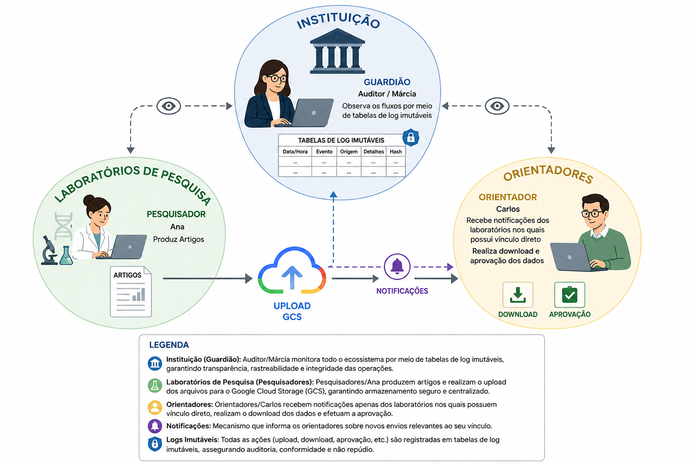

# :material-brain: Brainstorming e Priorização

O levantamento focado no usuário nos afastou de criar features genéricas (como "Rede Social Acadêmica" ou "Chat") e mirou diretamente no fluxo transacional de envio, restrição e aprovação de documentos em nuvem.

## 1. O Problema Real
Conversas informais de 30 minutos com docentes e membros da secretaria da universidade evidenciaram que o maior risco não é o sistema sair do ar, mas sim a **quebra de sigilo** de teses inéditas.

## 2. Matriz de Funcionalidades Descobertas

O resultado do Brainstorming foi organizado através da matriz MoSCoW (Must, Should, Could, Won't):

| Funcionalidade Sugerida | Categoria | Relevância (MoSCoW) |
| :--- | :--- | :--- |
| Upload de PDFs até 50MB (GCS) | Documentos |  Must Have |
| Upload de CSV/JSON (Datasets) | Documentos |  Should Have |
| Filtro de isolamento de laboratório | Orientação |  Must Have |
| Registro Imutável de Logs | Auditoria |  Must Have |

## 3. Visão Sistêmica Macro (Rich Picture)

>Fonte: Elaborado pelo autor com auxílio de inteligência artificial generativa (ChatGPT/OpenAI, 2026).

---

## Histórico de Versões

| Versão |    Data    | Descrição                        | Autor                    |
| :---: | :---: | :--- | :--- |
| `1.0`  | 30/05/2026 | Criação do documento             | Pedro Henrique P. Santos |
| `1.1`  | 30/05/2026 | Rich Picture com animação e zoom | Pedro Henrique P. Santos |
| 1.2 | 13/06/2026 | Revisão técnica e reestruturação da documentação | Pedro Henrique P. Santos |
