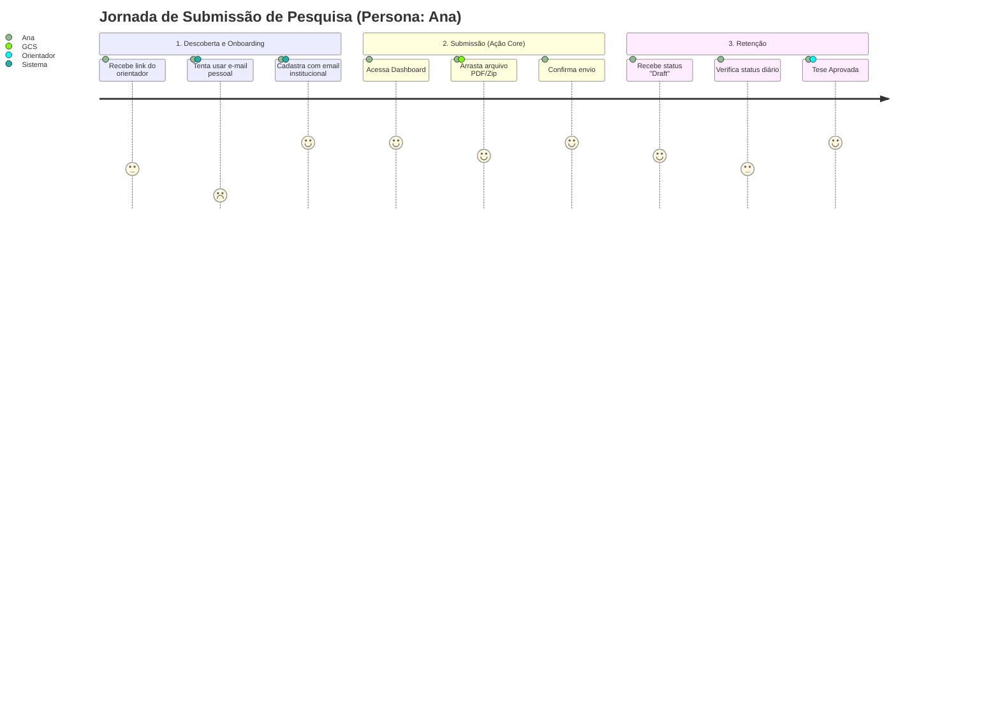
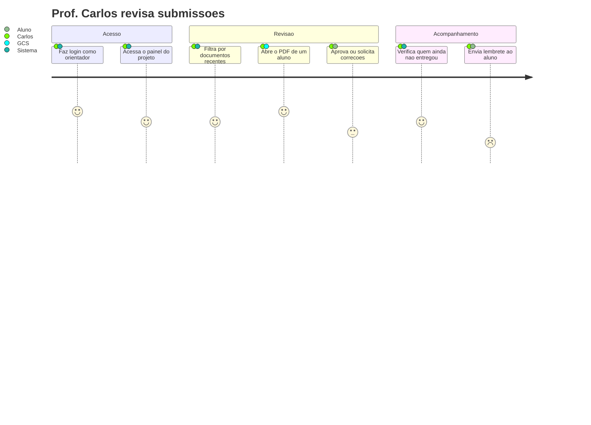
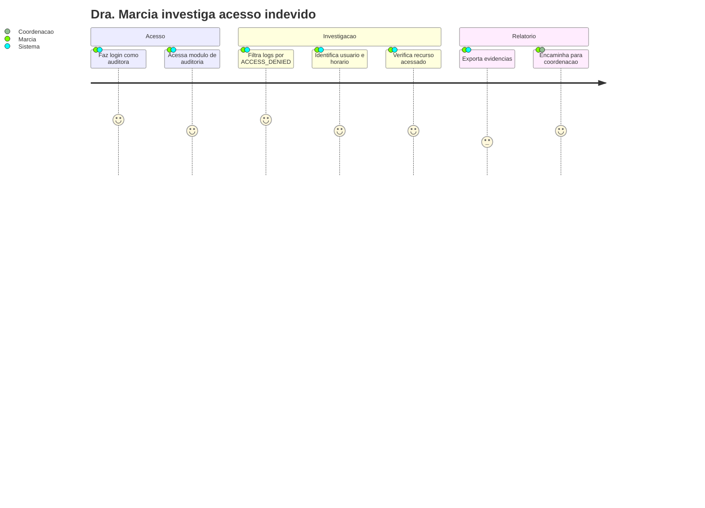

# :material-map-marker-path: Mapeamento de Jornadas (User Journey)

Abaixo estão os fluxos principais que cada persona percorre ao utilizar o EdTech, desenhados durante os workshops de Discovery.

!!! info "Legenda de Satisfação (Carinhas nos diagramas)"
    Os diagramas utilizam um escore de 1 a 5 para mapear a jornada emocional do usuário em cada etapa:

    - ☹️ **Frustração (Pontuação 1 a 2):** Etapas de atrito, dor ou em que o usuário está enfrentando problemas (como tentar usar e-mail pessoal ou lidar com sistemas defasados).

    - 😐 **Neutro (Pontuação 3):** Tarefas burocráticas ou transições de estado, sem forte emoção atrelada.

    - 😃 **Satisfação (Pontuação 4 a 5):** Etapas onde o usuário teve facilidade, atingiu o sucesso na tarefa e ficou feliz com o fluxo.

## Jornada 1 — Ana (Pesquisadora) envia um artigo

1. **Descoberta:** Ana recebe o link do repositório pelo seu orientador.

2. **Onboarding:** Ela se cadastra utilizando obrigatoriamente o e-mail institucional (`@instituicao.edu.br`).

3. **Ação Principal:** Faz upload do `artigo_final.pdf`.

4. **Retenção/Acompanhamento:** Entra semanalmente na plataforma para verificar se o status mudou.

## Jornada 2 — Prof. Carlos (Orientador) revisa submissões

1. **Acesso:** Faz login como orientador e acessa o painel do projeto.

2. **Revisão:** Filtra por documentos recentes, abre o PDF de um aluno e aprova ou solicita correções.

3. **Acompanhamento:** Verifica quem ainda não entregou e envia lembrete ao aluno.

## Jornada 3 — Dra. Márcia (Auditora) investiga acesso

1. **Acesso:** Faz login como auditora e acessa o módulo de auditoria.

2. **Investigação:** Filtra logs por `ACCESS_DENIED`, identifica usuário e horário, e verifica qual recurso foi acessado.

3. **Relatório:** Exporta evidências e encaminha para a coordenação.

---

## Histórico de Versões

| Versão | Data | Descrição | Autor |
| :---: | :---: | :--- | :--- |
| `1.0` | 30/05/2026 | Criação do documento | Pedro Henrique P. Santos |
| 1.1 | 13/06/2026 | Revisão técnica e reestruturação da documentação | Pedro Henrique P. Santos |
