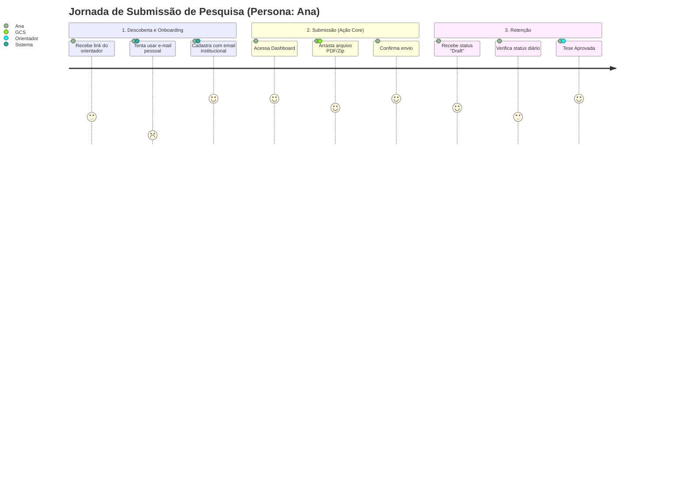
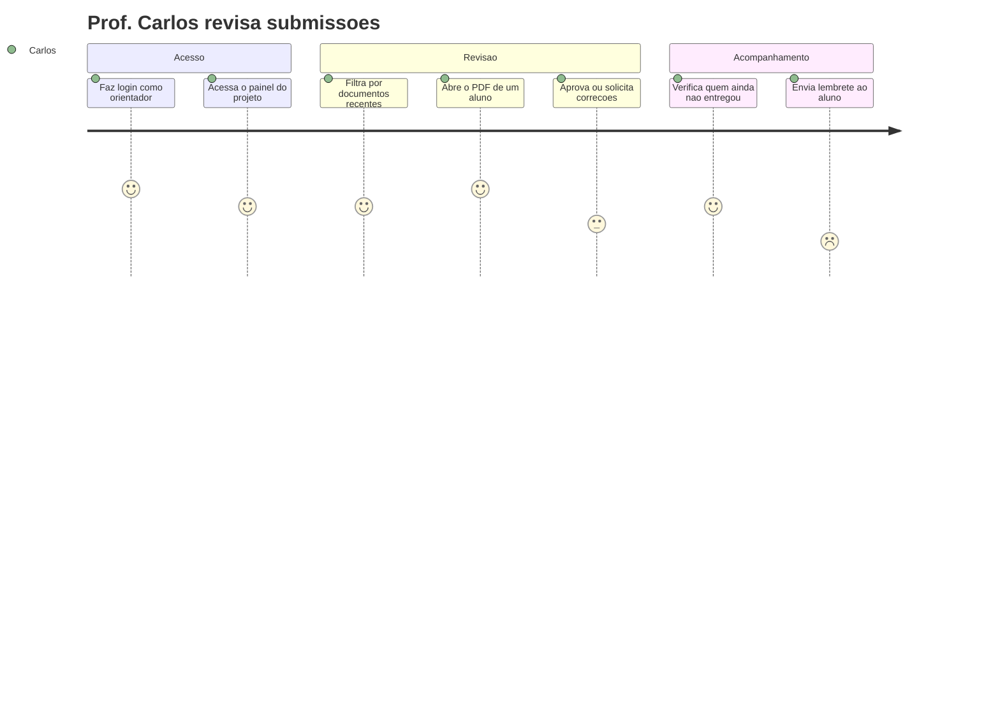
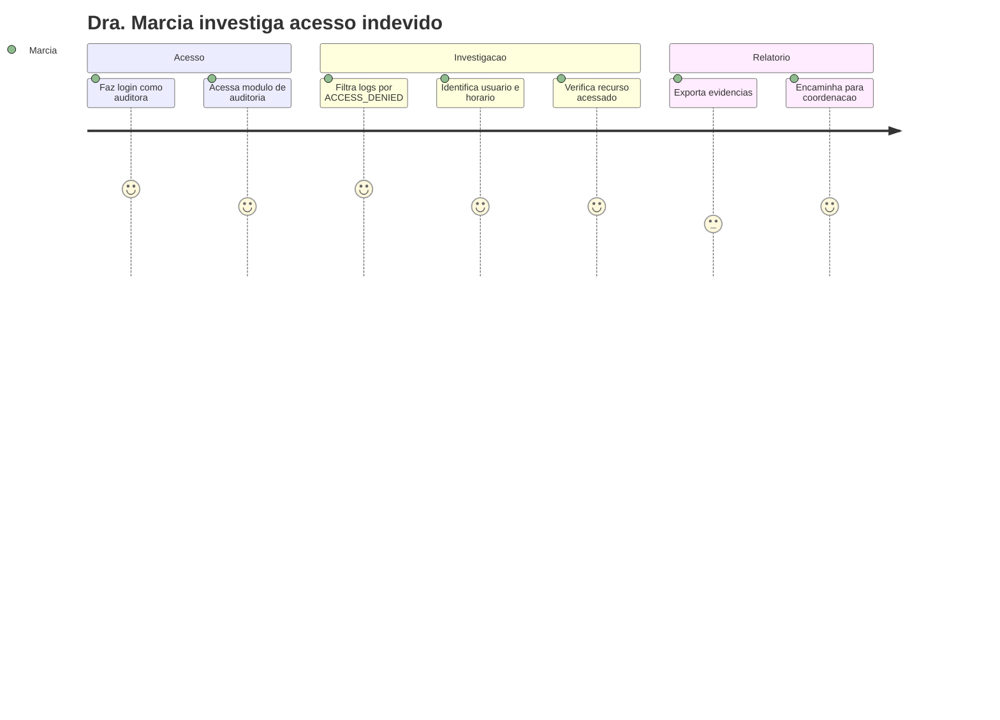

# :material-map-marker-path: Mapeamento de Jornadas (User Journey)

Abaixo estão os fluxos principais que cada persona percorre ao utilizar o EdTech, desenhados durante os workshops de Discovery.

## Jornada 1 — Ana (Pesquisadora) envia um artigo

1. **Descoberta:** Ana recebe o link do repositório pelo seu orientador.
2. **Onboarding:** Ela se cadastra utilizando obrigatoriamente o e-mail institucional (`@instituicao.edu.br`).
3. **Ação Principal:** Faz upload do `artigo_final.pdf`.
4. **Retenção/Acompanhamento:** Entra semanalmente na plataforma para verificar se o status mudou.

## Jornada 2 — Prof. Carlos (Orientador) revisa submissões

## Jornada 3 — Dra. Márcia (Auditora) investiga acesso

---

## Histórico de Versões

| Versão | Data | Descrição | Autor |
| :---: | :---: | :--- | :--- |
| `1.0` | 30/05/2026 | Criação do documento | Pedro Henrique P. Santos |
