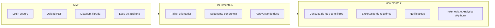

# :material-diamond-stone: Canvas MVP

Definição do Produto Mínimo Viável (MVP) do EdTech — o menor conjunto de funcionalidades que entrega valor real aos usuários.

---

## Canvas

- :material-bullseye: **Proposta do MVP**

    ---

    Permitir que pesquisadores façam login seguro, enviem documentos em PDF e os visualizem em uma lista filtrada por autor, com logs de auditoria registrando todas as ações.

- :material-account-group: **Personas Segmentadas**

    ---

    - **MVP inclui:** Ana (Pesquisadora) — perfil principal

    - **Pós-MVP:** Prof. Carlos (Orientador), Dra. Márcia (Auditora)

- :material-format-list-checks: **Funcionalidades do MVP**

    ---

    - F01: Cadastro de pesquisador

    - F02: Login com JWT seguro

    - F03: Logout

    - F07: Upload de PDF

    - F09: Armazenamento no GCS

    - F10: Listagem filtrada por autor

    - F11: Download de documentos

    - F18: Log de login/logout

    - F19: Log de uploads

- :material-currency-usd: **Custo e Cronograma**

    ---

    - **Sprints necessárias:** 8 (Sprints 1 a 8)
    - **Duração estimada:** 8 semanas

    - **Infra:** Google Cloud (free tier)

- :material-chart-line: **Resultado Esperado**

    ---

    - Pesquisadores conseguem armazenar documentos de forma segura

    - Cada pesquisador vê apenas seus próprios arquivos

    - Todas as ações ficam registradas para auditoria

    - Base pronta para adicionar orientador e painel de auditoria

- :material-ruler: **Métricas de Validação**

    ---

    - ≥ 5 uploads realizados com sucesso

    - 0 acessos cross-user (isolamento funcional)
    - 100% das ações logadas na tabela `audit_logs`
    - Tempo de upload < 5 segundos

---

## MVP vs Incrementos

---

## Definição de Pronto (DoD) do MVP

!!! success "O MVP está pronto quando:"

    - [x] Um pesquisador consegue se cadastrar e fazer login

    - [x] O pesquisador consegue fazer upload de um PDF

    - [x] O documento aparece na sua lista pessoal

    - [x] O pesquisador consegue fazer download do seu documento

    - [x] Outro pesquisador **não** consegue ver o documento

    - [x] Todas as ações geram registros na tabela `audit_logs`
    - [x] O sistema roda containerizado via Docker

    - [x] Testes unitários cobrem os endpoints da API

---

## Histórico de Versões

| Versão | Data | Descrição | Autor |
| :---: | :---: | :--- | :--- |
| `1.0` | 30/05/2026 | Criação do documento | Pedro Henrique P. Santos |
| `1.1` | 13/06/2026 | Revisão técnica e reestruturação da documentação | Pedro Henrique P. Santos |
| `2.0.0` | 04/07/2026 | Revisão profunda, correção de metadados e melhorias visuais | Pedro Henrique P. Santos |

