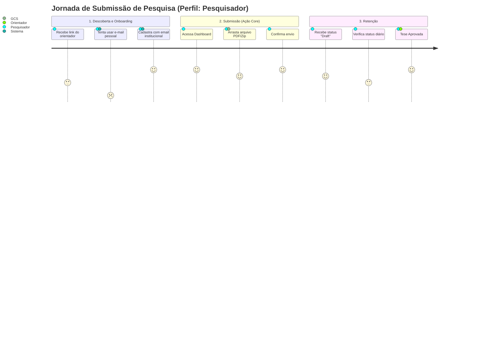
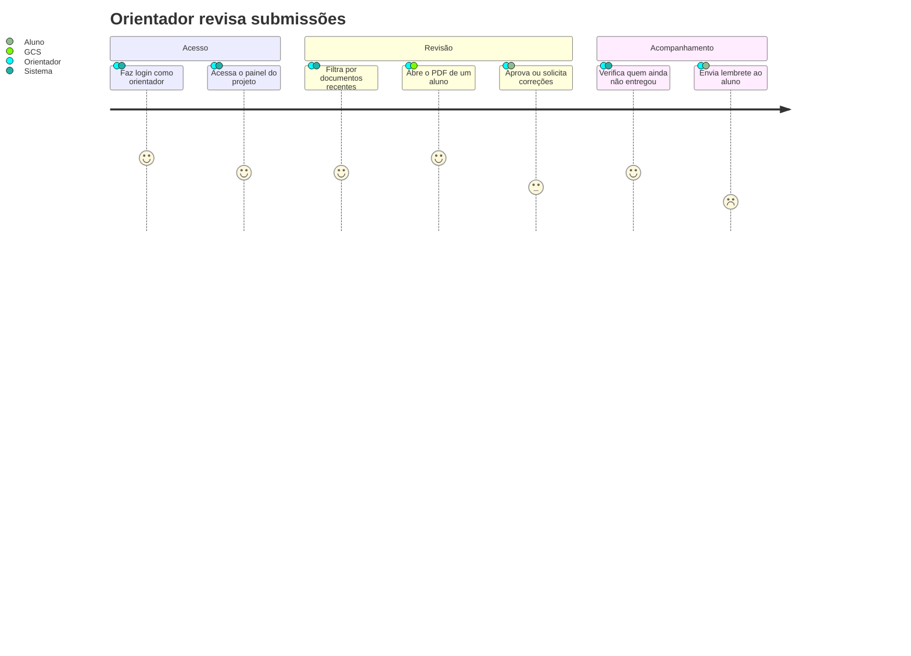
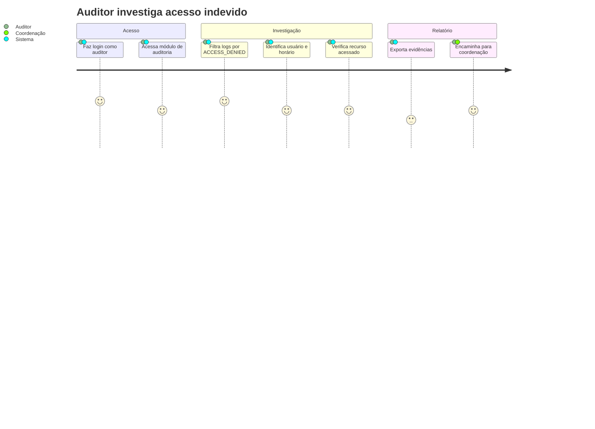

# :material-map-marker-path: Mapeamento de Jornadas (User Journey)

Abaixo estão os fluxos principais que cada perfil institucional percorre ao utilizar o EdTech, desenhados durante os workshops de Discovery.

!!! info "Legenda de Satisfação (Carinhas nos diagramas)"
    Os diagramas utilizam um escore de 1 a 5 para mapear a jornada emocional do usuário em cada etapa:

    - :material-emoticon-sad: **Frustração (Pontuação 1 a 2):** Etapas de atrito, dor ou em que o usuário está enfrentando problemas (como tentar usar e-mail pessoal ou lidar com sistemas defasados).

    - :material-emoticon-neutral: **Neutro (Pontuação 3):** Tarefas burocráticas ou transições de estado, sem forte emoção atrelada.

    - :material-emoticon-happy: **Satisfação (Pontuação 4 a 5):** Etapas onde o usuário teve facilidade, atingiu o sucesso na tarefa e ficou feliz com o fluxo.

## Jornada 1 — Submissão de Artigo (Pesquisador)

1. **Descoberta:** O pesquisador recebe o link do repositório pelo seu orientador.

2. **Onboarding:** Cadastra-se utilizando obrigatoriamente o e-mail institucional (`@instituicao.edu.br`).

3. **Ação Principal:** Faz upload do `artigo_final.pdf`.

4. **Retenção/Acompanhamento:** Entra semanalmente na plataforma para verificar se o status mudou.

## Jornada 2 — Revisão de Submissões (Orientador)

1. **Acesso:** Faz login como orientador e acessa o painel do projeto.

2. **Revisão:** Filtra por documentos recentes, abre o PDF de um aluno e aprova ou solicita correções.

3. **Acompanhamento:** Verifica quem ainda não entregou e envia lembrete ao aluno.

## Jornada 3 — Investigação de Acesso (Auditor)

1. **Acesso:** Faz login como auditor e acessa o módulo de auditoria.

2. **Investigação:** Filtra logs por `ACCESS_DENIED`, identifica usuário e horário, e verifica qual recurso foi acessado.

3. **Relatório:** Exporta evidências e encaminha para a coordenação.

---

## Histórico de Versões

| Versão | Data | Descrição | Autor |
| :---: | :---: | :--- | :--- |
| `1.0` | 30/05/2026 | Criação do documento | Pedro Henrique P. Santos |
| `1.1` | 13/06/2026 | Revisão técnica e reestruturação da documentação | Pedro Henrique P. Santos |
| `2.0` | 04/07/2026 | Revisão profunda, correção de metadados e melhorias visuais | Pedro Henrique P. Santos |
| `3.0` | 06/07/2026 | Atualização para tom mais formal, removendo nomes de personas e focando nos papéis institucionais | Pedro Henrique P. Santos |

