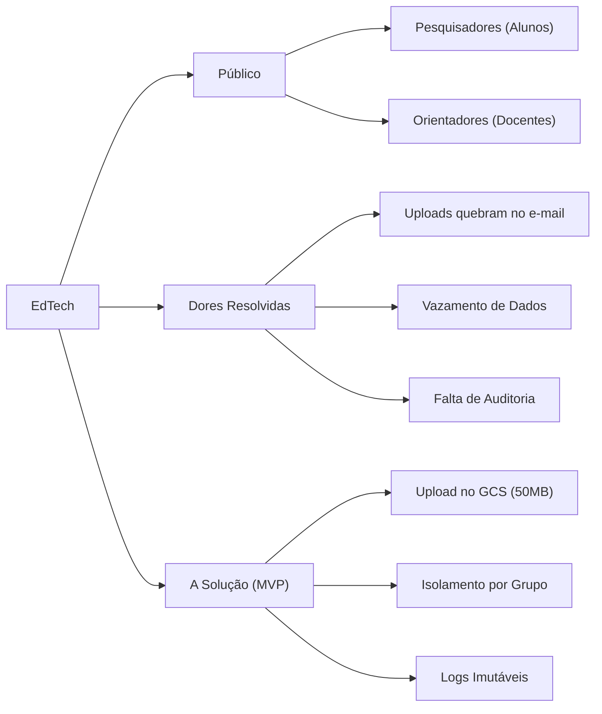

# :material-bullseye-arrow: Visão e Escopo do Produto

## :material-star-shooting: A Essência do Produto

O Propósito (Elevator Pitch) que norteia todas as decisões.

-   :material-account-group: **Para**
    
    ---

    Pesquisadores e Docentes Orientadores da Universidade.

-   :material-alert-circle: **Cujo problema é**
    
    ---

    A desorganização no versionamento, falta de privacidade e ausência de auditoria em teses não publicadas.

-   :material-rocket-launch: **O EdTech é**
    
    ---

    Uma plataforma acadêmica de armazenamento com escopo e acesso fechado.

-   :material-shield-off: **Diferente de**
    
    ---

    Repositórios de acesso público e de soluções não-auditáveis genéricas (ex: Canvas, Google Drive, Dropbox).

-   :material-trophy: **Nossa Vantagem**
    
    ---

    Isolamento de projetos via banco de dados relacional para garantia de sigilo de Propriedade Intelectual (IP).

---

## :material-sitemap: Mapa Mental de Escopo

O mapa mental abaixo consolida o foco do produto de forma visual, removendo qualquer ambiguidade do que faz parte da solução:

---

## Histórico de Versões

| Versão | Data | Descrição | Autor |
| :---: | :---: | :--- | :--- |
| `1.0` | 30/05/2026 | Criação do documento | Pedro Henrique P. Santos |
| `1.1` | 13/06/2026 | Revisão técnica e reestruturação da documentação | Pedro Henrique P. Santos |
| `1.2` | 04/07/2026 | Revisão profunda, correção de metadados e melhorias visuais | Pedro Henrique P. Santos |

