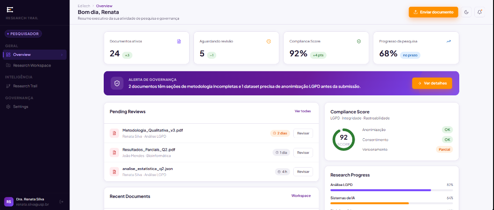
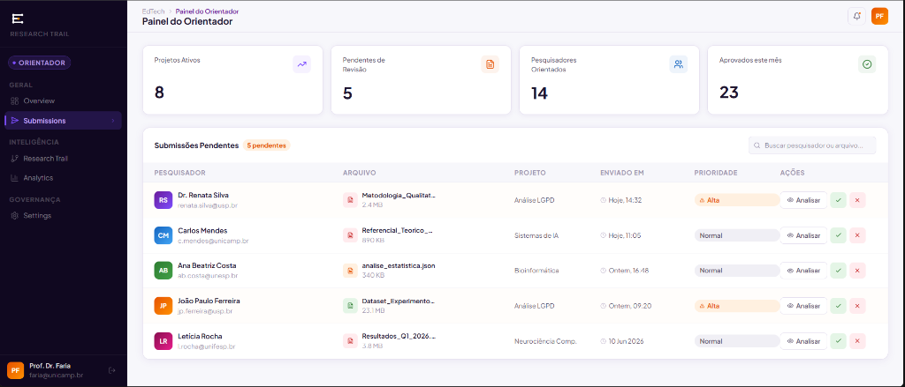

# :material-book-account: Manual do Usuário e Fluxos

Este manual detalha o funcionamento da plataforma EdTech a partir da perspectiva de cada um dos perfis de usuário (Personas).

---

## 1. Fluxo do Pesquisador (Aluno/Pesquisador)

O **Pesquisador** é o usuário principal que envia documentos acadêmicos para a plataforma.

### 1.1 Cadastro e Login
Para iniciar, o pesquisador deve realizar seu cadastro informando e-mail, senha e nome completo. Após a confirmação, ele é redirecionado para a tela de login.

### 1.2 Upload de Documentos
Na tela de envio (Upload), o pesquisador pode selecionar um arquivo PDF, CSV ou JSON e vinculá-lo a um Projeto.

!!! tip
    São aceitos arquivos `.pdf`, `.csv` e `.json`. Arquivos executáveis ou com tipo incompatível são rejeitados pela validação de upload.

---

## 2. Fluxo do Orientador (Professor/Gestor)

O **Orientador** é o usuário responsável por validar as entregas do Pesquisador e assegurar a qualidade científica.

### 2.1 Dashboard de Acompanhamento
O painel do orientador apresenta métricas executivas, como a quantidade de documentos pendentes de revisão e o score de conformidade dos projetos em andamento.

### 2.2 Aprovação de Documentos
Acessando a lista de documentos em revisão, o Orientador pode visualizar um *preview* rápido do arquivo e utilizar os botões de ação para **Aprovar**, **Solicitar Alterações** ou **Rejeitar**.

!!! warning
    Uma vez aprovado, o documento é selado no banco de dados com um hash SHA-256 e qualquer modificação futura gerará uma nova versão.

---

## 3. Fluxo do Auditor (Membro LGPD/Comitê Ética)

O **Auditor** possui acesso exclusivo e restrito apenas à visão de rastreabilidade do sistema.

### 3.1 Tabela de Logs e Rastreabilidade
O Auditor pode pesquisar qualquer evento que tenha ocorrido no ciclo de vida de um documento, incluindo visualizações, downloads, edições de metadados e aprovações.

### 3.2 Exportação de Trilha de Auditoria
A tabela permite aplicar filtros por intervalo de data, usuário e tipo de ação. A trilha de auditoria de um documento também pode ser exportada em CSV pelo endpoint `GET /api/documents/{id}/audit/export?format=csv`, permitindo uso em auditorias externas de compliance.

!!! note
    Os logs não podem ser apagados ou modificados nem por usuários com perfil de Administrador.

---

## 4. Matriz de Permissões e Controle de Acesso (RBAC)

Para garantir o isolamento e segurança da plataforma, as ações são restritas aos papéis de cada usuário, conforme tabela abaixo:

| Perfil | O que PODE fazer | O que NÃO PODE fazer |
| --- | --- | --- |
| **Pesquisador** | - Autenticar no sistema. - Fazer upload de documentos e datasets (PDF, CSV, JSON). - Visualizar seus próprios projetos/documentos. | - Visualizar documentos de outros pesquisadores. - Aprovar ou rejeitar documentos. - Visualizar logs de auditoria. |
| **Orientador** | - Visualizar documentos de **todos** os pesquisadores sob sua orientação. - Aprovar, Solicitar Alterações ou Rejeitar envios. - Extrair métricas do painel de controle. | - Acessar projetos de laboratórios os quais não orienta. - Apagar ou alterar logs de auditoria. |
| **Auditor** | - Visualizar todos os eventos e rastreabilidade (`AuditLog`). - Auditar tentativas de acesso negado ou falhas de login. - Exportar trilha de auditoria para fins de compliance. | - Fazer upload, aprovar ou modificar documentos. - Modificar perfis de usuários. - Alterar qualquer registro histórico do sistema. |

---

## Histórico de Versões

| Versão | Data | Descrição | Autor |
| :---: | :---: | :--- | :--- |
| `1.0` | 04/07/2026 | Refatoração inicial da documentação | Pedro Henrique P. Santos |
| `1.1` | 04/07/2026 | Revisão profunda, correção de metadados e melhorias visuais | Pedro Henrique P. Santos |
| `1.2` | 09/07/2026 | Atualização de formatos de upload e exportação CSV da auditoria | Pedro Henrique P. Santos |
