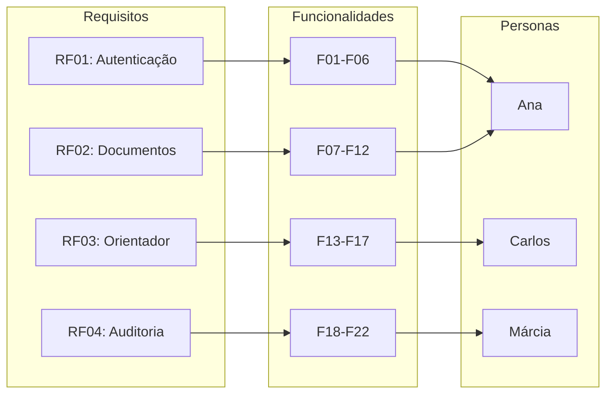
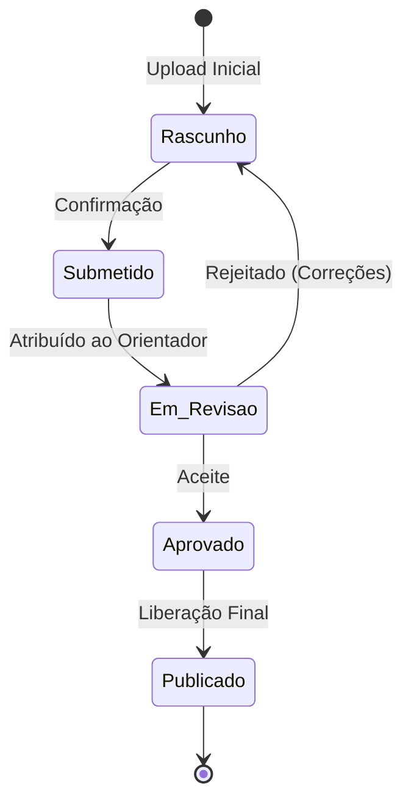

# :material-format-list-checks: Requisitos Funcionais

Especificação dos requisitos funcionais do EdTech, organizados por módulo e rastreáveis às funcionalidades do Lean Inception.

---

## RF01 — Autenticação e Sessão

| ID | Requisito | Prioridade | Funcionalidade | Status |
| :---: | :--- | :---: | :---: | :---: |
| RF01.1 | O sistema deve permitir o cadastro de pesquisadores com nome, e-mail institucional e senha | 🔴 Alta | F01 | ⬜ |
| RF01.2 | O sistema deve autenticar usuários via e-mail e senha, retornando um JWT em cookie `HttpOnly` | 🔴 Alta | F02 | ⬜ |
| RF01.3 | O sistema deve invalidar o cookie de sessão no logout | 🔴 Alta | F03 | ⬜ |
| RF01.4 | O sistema deve interceptar todas as requisições para validar o JWT antes de processar | 🔴 Alta | F04 | ⬜ |
| RF01.5 | O sistema deve retornar `401 Unauthorized` quando o token estiver expirado ou ausente | 🟡 Média | F05 | ⬜ |
| RF01.6 | O sistema deve validar que o e-mail pertence a um domínio institucional (`@instituicao.edu.br`) | 🟡 Média | F01 | ⬜ |

---

## RF02 — Upload e Gerenciamento de Documentos

| ID | Requisito | Prioridade | Funcionalidade | Status |
| :---: | :--- | :---: | :---: | :---: |
| RF02.1 | O sistema deve permitir o upload de arquivos PDF com tamanho máximo de 50 MB | 🔴 Alta | F07 | ⬜ |
| RF02.2 | O sistema deve armazenar o arquivo binário no Google Cloud Storage e os metadados no PostgreSQL | 🔴 Alta | F09 | ⬜ |
| RF02.3 | O sistema deve associar cada documento ao `user_id` do autor autenticado | 🔴 Alta | F07 | ⬜ |
| RF02.4 | O sistema deve exibir uma lista de documentos filtrada pelo `author_id` do usuário logado | 🔴 Alta | F10 | ⬜ |
| RF02.5 | O sistema deve permitir o download de documentos apenas pelo autor ou orientador vinculado | 🔴 Alta | F11 | ⬜ |
| RF02.6 | O sistema deve permitir a exclusão de documentos com status `draft` pelo autor | 🟡 Média | F12 | ⬜ |
| RF02.7 | O sistema deve aceitar upload de datasets nos formatos CSV e JSON | 🟡 Média | F08 | ⬜ |

---

## RF03 — Orientador e Isolamento

| ID | Requisito | Prioridade | Funcionalidade | Status |
| :---: | :--- | :---: | :---: | :---: |
| RF03.1 | O sistema deve exibir um painel com todos os projetos vinculados ao orientador | 🔴 Alta | F13 | ⬜ |
| RF03.2 | O orientador deve visualizar documentos apenas de pesquisadores pertencentes aos seus projetos | 🔴 Alta | F14 | ⬜ |
| RF03.3 | O sistema deve filtrar queries por `project_members.user_id` para garantir isolamento entre laboratórios | 🔴 Alta | F15 | ⬜ |
| RF03.4 | O orientador deve poder aprovar ou rejeitar submissões, alterando o status do documento | 🟡 Média | F16 | ⬜ |

---

## RF04 — Auditoria

| ID | Requisito | Prioridade | Funcionalidade | Status |
| :---: | :--- | :---: | :---: | :---: |
| RF04.1 | O sistema deve registrar logs imutáveis para login bem-sucedido e falho | 🔴 Alta | F18 | ⬜ |
| RF04.2 | O sistema deve registrar logs de upload e download de documentos | 🔴 Alta | F19 | ⬜ |
| RF04.3 | O sistema deve registrar tentativas de acesso negado (`403 Forbidden`) | 🔴 Alta | F20 | ⬜ |
| RF04.4 | O auditor deve poder consultar logs com filtros por ação, data e usuário | 🟡 Média | F21 | ⬜ |
| RF04.5 | O auditor deve poder exportar relatórios de auditoria | 🟢 Baixa | F22 | ⬜ |

---

## Matriz de Rastreabilidade

---

## Ciclo de Vida de Tese/Artigo

---

## Histórico de Versões

| Versão | Data | Descrição | Autor |
| :---: | :---: | :--- | :--- |
| `1.0` | 29/05/2026 | Criação do documento | Pedro Henrique P. Santos |
| `1.1` | 30/05/2026 | Criação do diagrama de ciclo de vida | Pedro Henrique P. Santos |
