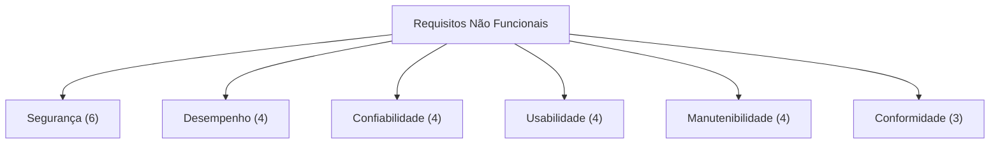

# Requisitos Não Funcionais

Restrições de qualidade, desempenho, segurança e operação que o EdTech deve atender.

---

## Categorias

### RNF01 a RNF06 — Segurança

| ID | Requisito | Métrica | Verificação |
| :---: | :--- | :--- | :--- |
| RNF01 | Senhas devem ser armazenadas com hash BCrypt (custo ≥ 12) | Custo do encoder | Inspeção de código |
| RNF02 | Tokens JWT devem ser transmitidos exclusivamente via cookies `HttpOnly` + `Secure` + `SameSite=Strict` | Flags do cookie | Teste de integração |
| RNF03 | Tokens JWT devem expirar em no máximo 1 hora | `Max-Age` do cookie | Teste automatizado |
| RNF04 | O sistema não deve expor informações sobre e-mails cadastrados em respostas de erro | Mensagem genérica | Teste de penetração |
| RNF05 | Todas as comunicações devem ocorrer via HTTPS | Certificado SSL | Cloud Run default |
| RNF06 | Dados sensíveis (chaves, credenciais) não devem estar presentes no código-fonte | Scan de secrets | GitHub Actions |

---

### RNF07 a RNF10 — Desempenho

| ID | Requisito | Métrica | Verificação |
| :---: | :--- | :--- | :--- |
| RNF07 | O tempo de resposta da API para listagem de documentos deve ser < 500ms (p95) | Latência p95 | Teste de carga |
| RNF08 | O upload de um PDF de até 10 MB deve completar em < 5 segundos | Tempo de upload | Teste funcional |
| RNF09 | O sistema deve suportar ao menos 50 usuários simultâneos | Concorrência | Teste de carga |
| RNF10 | A página de login deve carregar em < 2 segundos (LCP) | Core Web Vitals | Lighthouse |

---

### RNF11 a RNF14 — Confiabilidade e Disponibilidade

| ID | Requisito | Métrica | Verificação |
| :---: | :--- | :--- | :--- |
| RNF11 | O banco de dados deve ter backup automático diário com retenção de 7 dias | Política de backup | Cloud SQL config |
| RNF12 | A tabela `audit_logs` não deve permitir operações de UPDATE ou DELETE | Imutabilidade | Inspeção de código + teste |
| RNF13 | O sistema deve estar disponível ≥ 99% do tempo (excluindo janelas de manutenção) | Uptime | Cloud Run SLA |
| RNF14 | Documentos no Cloud Storage devem ter redundância geográfica | Classe de storage | GCS config |

---

### RNF15 a RNF18 — Usabilidade

| ID | Requisito | Métrica | Verificação |
| :---: | :--- | :--- | :--- |
| RNF15 | A interface deve ser responsiva para desktop e tablet (≥ 768px) | Breakpoints | Teste visual |
| RNF16 | Formulários devem exibir feedback visual imediato para campos inválidos | Tempo de feedback | Teste funcional |
| RNF17 | O sistema deve suportar modo claro e modo escuro | Toggle de tema | Teste visual |
| RNF18 | Mensagens de erro devem ser claras e em português | Idioma | Inspeção |

---

### RNF19 a RNF22 — Manutenibilidade

| ID | Requisito | Métrica | Verificação |
| :---: | :--- | :--- | :--- |
| RNF19 | A cobertura de testes unitários deve ser ≥ 80% no backend | Coverage report | JUnit + JaCoCo |
| RNF20 | Todo código deve seguir a convenção de commits (Conventional Commits) | Formato do commit | GitHub Actions |
| RNF21 | O deploy deve ser automatizado via CI/CD (zero intervenção manual) | Pipeline | GitHub Actions |
| RNF22 | Toda integração com a `main` deve ser via Pull Request aprovado | Branch protection | GitHub config |

---

### RNF23 a RNF25 — Conformidade

| ID | Requisito | Métrica | Verificação |
| :---: | :--- | :--- | :--- |
| RNF23 | O sistema deve estar em conformidade com a LGPD para dados de pesquisadores | Análise jurídica | Revisão documental |
| RNF24 | Logs de auditoria devem registrar IP, user-agent e timestamp de cada ação | Campos do log | Inspeção de código |
| RNF25 | O sistema deve impedir acesso a dados de projetos sem vínculo direto | Isolamento | Testes de acesso |

---

## Resumo Visual

---

## Histórico de Versões

| Versão | Data | Descrição | Autor |
| :---: | :---: | :--- | :--- |
| `1.0` | 29/05/2026 | Criação do documento | Pedro Henrique P. Santos |
| `1.1` | 13/06/2026 | Revisão técnica e reestruturação da documentação | Pedro Henrique P. Santos |

