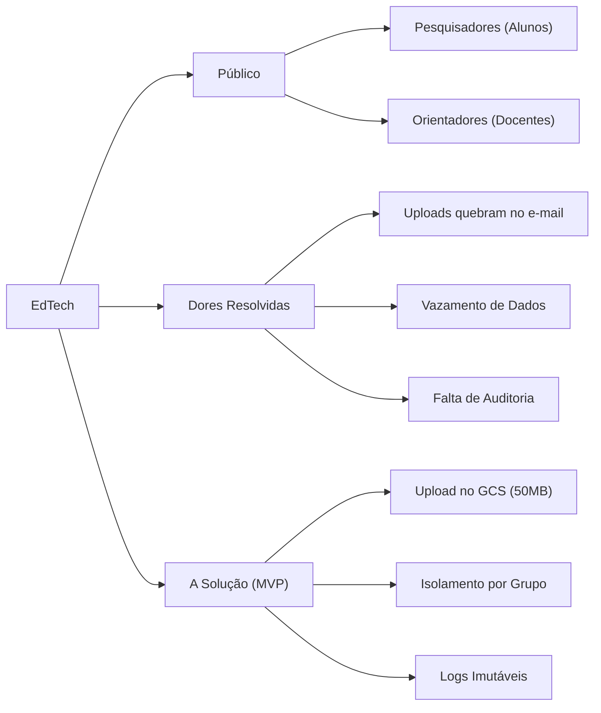

# :material-bullseye-arrow: Visão e Escopo do Produto

O mapa mental abaixo consolida o foco do produto, removendo qualquer ambiguidade de escopo:

## A Essência do Produto

- **Para:** Pesquisadores e Docentes Orientadores da Universidade.
- **Cujo problema é:** A alta desorganização no versionamento, privacidade de teses não publicadas e falta de uma trilha de auditoria confiável no tráfego de PDF.
- **O EdTech é:** Uma plataforma de armazenamento de PDF com escopo fechado.
- **Diferente de:** Repositórios acadêmicos públicos genéricos.
- **Nossa Vantagem:** Isolamento de projetos através de acesso em banco de dados relacional para garantia do sigilo de IP (Propriedade Intelectual).

---

## Histórico de Versões

| Versão | Data | Descrição | Autor |
| :---: | :---: | :--- | :--- |
| `1.0` | 30/05/2026 | Criação do documento | Pedro Henrique P. Santos |
