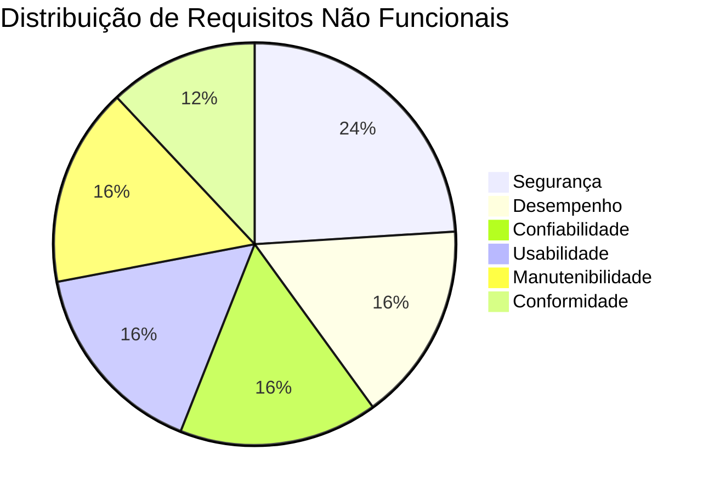

# :material-shield-check: Requisitos Não Funcionais

Restrições de qualidade, desempenho, segurança e operação que o EdTech deve atender.

---

## Categorias

### :material-lock: RNF01 — Segurança

| ID | Requisito | Métrica | Verificação |
| :---: | :--- | :--- | :--- |
| RNF01.1 | Senhas devem ser armazenadas com hash BCrypt (custo ≥ 12) | Custo do encoder | Inspeção de código |
| RNF01.2 | Tokens JWT devem ser transmitidos exclusivamente via cookies `HttpOnly` + `Secure` + `SameSite=Strict` | Flags do cookie | Teste de integração |
| RNF01.3 | Tokens JWT devem expirar em no máximo 1 hora | `Max-Age` do cookie | Teste automatizado |
| RNF01.4 | O sistema não deve expor informações sobre e-mails cadastrados em respostas de erro | Mensagem genérica | Teste de penetração |
| RNF01.5 | Todas as comunicações devem ocorrer via HTTPS | Certificado SSL | Cloud Run default |
| RNF01.6 | Dados sensíveis (chaves, credenciais) não devem estar presentes no código-fonte | Scan de secrets | GitHub Actions |

---

### :material-speedometer: RNF02 — Desempenho

| ID | Requisito | Métrica | Verificação |
| :---: | :--- | :--- | :--- |
| RNF02.1 | O tempo de resposta da API para listagem de documentos deve ser < 500ms (p95) | Latência p95 | Teste de carga |
| RNF02.2 | O upload de um PDF de até 10 MB deve completar em < 5 segundos | Tempo de upload | Teste funcional |
| RNF02.3 | O sistema deve suportar ao menos 50 usuários simultâneos | Concorrência | Teste de carga |
| RNF02.4 | A página de login deve carregar em < 2 segundos (LCP) | Core Web Vitals | Lighthouse |

---

### :material-database-check: RNF03 — Confiabilidade e Disponibilidade

| ID | Requisito | Métrica | Verificação |
| :---: | :--- | :--- | :--- |
| RNF03.1 | O banco de dados deve ter backup automático diário com retenção de 7 dias | Política de backup | Cloud SQL config |
| RNF03.2 | A tabela `audit_logs` não deve permitir operações de UPDATE ou DELETE | Imutabilidade | Inspeção de código + teste |
| RNF03.3 | O sistema deve estar disponível ≥ 99% do tempo (excluindo janelas de manutenção) | Uptime | Cloud Run SLA |
| RNF03.4 | Documentos no Cloud Storage devem ter redundância geográfica | Classe de storage | GCS config |

---

### :material-cellphone-link: RNF04 — Usabilidade

| ID | Requisito | Métrica | Verificação |
| :---: | :--- | :--- | :--- |
| RNF04.1 | A interface deve ser responsiva para desktop e tablet (≥ 768px) | Breakpoints | Teste visual |
| RNF04.2 | Formulários devem exibir feedback visual imediato para campos inválidos | Tempo de feedback | Teste funcional |
| RNF04.3 | O sistema deve suportar modo claro e modo escuro | Toggle de tema | Teste visual |
| RNF04.4 | Mensagens de erro devem ser claras e em português | Idioma | Inspeção |

---

### :material-wrench: RNF05 — Manutenibilidade

| ID | Requisito | Métrica | Verificação |
| :---: | :--- | :--- | :--- |
| RNF05.1 | A cobertura de testes unitários deve ser ≥ 80% no backend | Coverage report | JUnit + JaCoCo |
| RNF05.2 | Todo código deve seguir a convenção de commits (Conventional Commits) | Formato do commit | GitHub Actions |
| RNF05.3 | O deploy deve ser automatizado via CI/CD (zero intervenção manual) | Pipeline | GitHub Actions |
| RNF05.4 | Toda integração com a `main` deve ser via Pull Request aprovado | Branch protection | GitHub config |

---

### :material-scale-balance: RNF06 — Conformidade

| ID | Requisito | Métrica | Verificação |
| :---: | :--- | :--- | :--- |
| RNF06.1 | O sistema deve estar em conformidade com a LGPD para dados de pesquisadores | Análise jurídica | Revisão documental |
| RNF06.2 | Logs de auditoria devem registrar IP, user-agent e timestamp de cada ação | Campos do log | Inspeção de código |
| RNF06.3 | O sistema deve impedir acesso a dados de projetos sem vínculo direto | Isolamento | Testes de acesso |

---

## Resumo Visual

